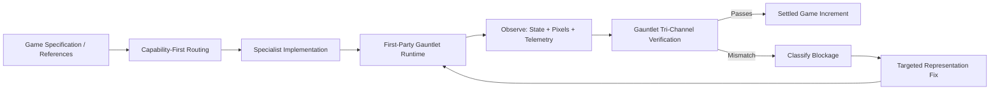

# Gauntlet Game Studio

**Gauntlet Game Studio turns a game specification and authorized references into a polished, verifiable, browser-native 3D game—and does not call the work finished until the game proves what it can actually do.**

Coding agents can generate Three.js snippets, prompt 3D models, write physics routines, and run browsers. The difficult problem is choosing the right representation for each job, preventing specialist tools from becoming competing sources of truth, and distinguishing a scene that merely *looks plausible* from a game whose simulation, rendering, navigation, physics, assets, and frame rate hold together under real browser conditions.

Gauntlet Game Studio solves that coordination and proof problem.

It routes requirements to narrow specialist capabilities, composes specialized tools behind stable contracts, maintains authoritative game state in a first-party ECS strictly separate from visual and DCC projections, and closes every development increment through a Gauntlet verification loop that observes **state, pixels, and telemetry**.

---

## The Core Loop



---

## Key Capabilities & Production Stack

Rather than relying on a monolithic engine or an opaque text-to-game prompt, the studio coordinates focused capabilities behind stable provider-neutral contracts:

| Subsystem / Capability | Production Implementation | Primary Responsibility |
| :--- | :--- | :--- |
| **Engine Runtime** | `@gauntlet/runtime` | First-party simulation kernel, fixed timestep scheduler, readiness barrier |
| **Authoritative State** | **Koota ECS** (`GameWorld`) | Entities, traits, game logic, systemic truth (isolated from scene objects) |
| **Rendering Projection** | **Three.js** (`^0.170.0`) | One-way visual projection, PBR materials, instancing, scene graphs |
| **Physics Simulation** | **Rapier 3D** (compat WASM) | Rigid bodies, colliders, character controllers, collision stepping |
| **Navigation & AI** | **Recast Navigation** | Navmesh generation, crowd agents, path corridor queries |
| **Spatial Acceleration** | **three-mesh-bvh** | Accelerated line-of-sight and raycast intersection structures |
| **World Composition** | **3dviz** | Scene composition, architecture, vegetation scatter, atmosphere |
| **Terrain Elevation** | **Deterministic Heightfield** | Mathematical elevation generation directly producing canonical grids |
| **Object Reconstruction**| **img2threejs** | Reference-image reconstruction into procedural Three.js modules |
| **Asset Optimization** | **glTF-Transform** | WebP/KTX2 texture compression, geometry pruning, LODs |
| **DCC Escalation** | **Blender** (headless CLI) | Retargeting, keyframe baking, topology cleanup (committed derivatives) |
| **Visual Effects (VFX)** | **three.quarks** | Particle systems, bursts, engine trails, beacon illumination |
| **Audio Engine** | **Tone.js** + **NullAudio** | Code-synthesized audio with gesture unlock (silent in headless tests) |
| **Multiplayer Transport**| **Bun WebSockets** | Authoritative server tick, sequenced commands, Koota snapshot replication |
| **Observability Bridge** | `window.__GAUNTLET_STUDIO_OBS__` | Versioned surface exposing state, telemetry, and dev/test controls |
| **Browser Proof** | **Playwright** | Deterministic headless scenarios, pixel captures, traces |
| **Settlement Engine** | **Gauntlet Bridge** | Tri-channel expectation settlement against frozen criteria |

---

## Monorepo Architecture

Gauntlet Game Studio is built as a lean Bun 1.4 monorepo:

```text
gauntlet-game-studio/
├── packages/
│   ├── contracts/          # Provider-neutral Zod schemas and TypeScript interfaces
│   ├── runtime/            # First-party engine: Koota, Three.js, Rapier, Recast, Network, Audio
│   ├── studio/             # Capability registry, router, asset registry, evidence store, settlement
│   └── adapters/           # Bridges to img2threejs, 3dviz, glTF-Transform, Blender, Tone, Playwright
├── apps/
│   └── studio-cli/         # Semantic command-line interface ('studio')
├── examples/
│   └── blackwater-relay/   # Reference game proving single-player and multiplayer paths
├── templates/
│   └── game/               # Standalone game scaffold for generated projects
└── scripts/                # Mechanical governance, traceability, and topology gates
```

---

## Quickstart

### Prerequisites
- **Bun** `>= 1.4.0`
- **Python 3** (for mechanical verification gates)
- **Just** (command runner)

### 1. Verify Environment & Workspace Health
```bash
# Run studio preflight diagnostic
just doctor

# Run monorepo typecheck, topology, and traceability checks
just check

# Run workspace unit and integration test suite
just test
```

### 2. Scaffold a New Independent Game Project
```bash
# Generate a new game project in a separate directory
bun run studio -- create ../my-mars-rover

# Enter the new game project
cd ../my-mars-rover

# Inspect the generated game's studio lock and health
bun run studio -- doctor
```

### 3. Run the Blackwater Relay Reference Game
```bash
# Build and run the single-player browser vertical slice
cd examples/blackwater-relay
bun run build

# Run headless scenario test progression (runs with zero DOM / WebGL)
bun test tests/scenarios-headless.test.ts

# Run end-to-end browser proof scenarios via Playwright
bun run test:e2e

# Run authoritative multiplayer proof (two browser clients + headless server)
bun run test:blackwater-multiplayer
```

---

## Core Operating Invariants

1. **State Is Not the Scene Graph**: Authoritative gameplay semantics live exclusively in Koota ECS (`GameWorld`). Three.js meshes, Rapier bodies, and Recast agents are one-way synchronized execution projections. Destroying a visual mesh does not mutate game logic.
2. **Tri-Channel Gauntlet Proof**: Completion is settled only when **state** (authoritative entity traits), **pixels** (visible rendered output), and **telemetry** (performance budgets) agree. A visually correct screenshot cannot override a semantic state failure (`pixels_pass_state_fail`).
3. **Headless Purity**: The simulation core imports and runs cleanly in headless environments without DOM, WebGL, or AudioContext.
4. **Single Step Owner**: Simulation ticks are advanced by fixed timesteps through `SimulationScheduler`. Duplicate step execution or secondary schedulers are blocked at runtime.
5. **Clean Asset Provenance**: Every committed asset requires an `AssetRecord` with origin, license, checksum, and append-only acceptance history.
6. **Production Lockout**: Privileged simulation control APIs on the observability bridge (`pause`, `step`, `resetScenario`, `setSeed`) exist only in development/test builds and are structurally stripped from production builds.

---

## Documentation System

Comprehensive technical documentation is organized by intent and reader need across Layers 0–8:

- **Orientation & Landing Page**: [`docs/index.md`](file:///~/projects/gauntlet-game-studio/docs/index.md)
- **System Mental Model**: [`docs/mental-model.md`](file:///~/projects/gauntlet-game-studio/docs/mental-model.md)
- **Canonical Architecture**: [`architecture.md`](file:///~/projects/gauntlet-game-studio/architecture.md)
- **Domain & Vocabulary Model**: [`docs/terminology.md`](file:///~/projects/gauntlet-game-studio/docs/terminology.md)
- **Documentation Map & Diátaxis Guide**: [`documentation-map.md`](file:///~/projects/gauntlet-game-studio/documentation-map.md)
- **Codebase Source Map**: [`source-map.md`](file:///~/projects/gauntlet-game-studio/source-map.md)

### Subsystem Guides
- [`packages/contracts`](file:///~/projects/gauntlet-game-studio/docs/subsystems/contracts.md): Lingua franca schemas and contracts
- [`packages/runtime`](file:///~/projects/gauntlet-game-studio/docs/subsystems/runtime.md): Engine kernel, Koota state, projections, networking
- [`packages/studio`](file:///~/projects/gauntlet-game-studio/docs/subsystems/studio.md): Capability routing, asset registry, Gauntlet settlement
- [`packages/adapters`](file:///~/projects/gauntlet-game-studio/docs/subsystems/adapters.md): External bridges (img2threejs, 3dviz, Blender, Tone)
- [`apps/studio-cli`](file:///~/projects/gauntlet-game-studio/docs/subsystems/cli.md): CLI commands and automation interface
- [`examples/blackwater-relay`](file:///~/projects/gauntlet-game-studio/docs/subsystems/blackwater-relay.md): Reference vertical slice game

### Tutorials & How-To Guides
- [Tutorial: Creating Your First Game](file:///~/projects/gauntlet-game-studio/docs/tutorials/first-game-project.md)
- [Tutorial: Adding & Settling a Gameplay Scenario](file:///~/projects/gauntlet-game-studio/docs/tutorials/adding-and-settling-a-scenario.md)
- [How-To: Add a New Studio Capability](file:///~/projects/gauntlet-game-studio/docs/how-to/add-new-capability.md)
- [How-To: Register and Verify an Asset](file:///~/projects/gauntlet-game-studio/docs/how-to/register-and-verify-asset.md)
- [How-To: Write and Execute a Gauntlet Proof](file:///~/projects/gauntlet-game-studio/docs/how-to/write-gauntlet-proof.md)
- [How-To: Debug Subsystem Readiness](file:///~/projects/gauntlet-game-studio/docs/how-to/debug-subsystem-readiness.md)

### Technical Reference
- [Studio CLI Command Reference](file:///~/projects/gauntlet-game-studio/docs/reference/cli.md)
- [Contracts & Schemas Reference](file:///~/projects/gauntlet-game-studio/docs/reference/contracts-and-schemas.md)
- [Observability Bridge Reference (`__GAUNTLET_STUDIO_OBS__`)](file:///~/projects/gauntlet-game-studio/docs/reference/observability-bridge.md)
- [Quality Profiles & Performance Budgets](file:///~/projects/gauntlet-game-studio/docs/reference/quality-profiles.md)
- [Verification Gates & Scripts Reference](file:///~/projects/gauntlet-game-studio/docs/reference/gates-and-verification.md)

---

## License & Provenance

Gauntlet Game Studio is licensed under the MIT License. See [LICENSE](file:///~/projects/gauntlet-game-studio/LICENSE) and [THIRD_PARTY_NOTICES.md](file:///~/projects/gauntlet-game-studio/THIRD_PARTY_NOTICES.md) for complete licensing and third-party attribution.
