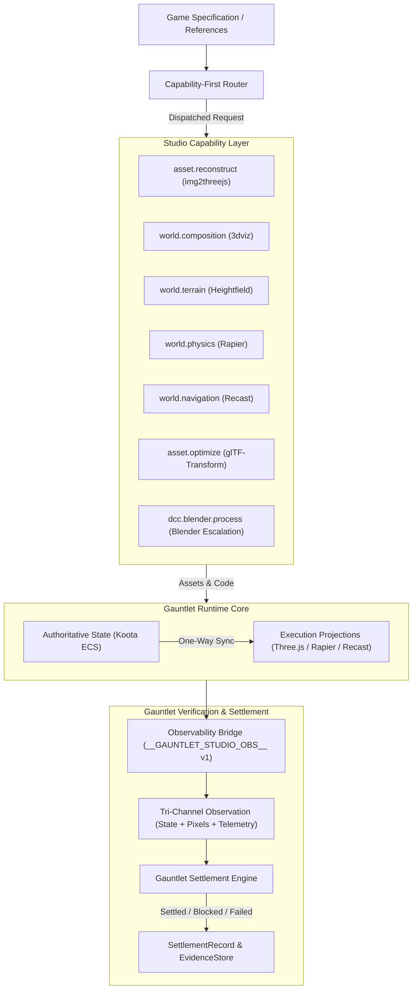
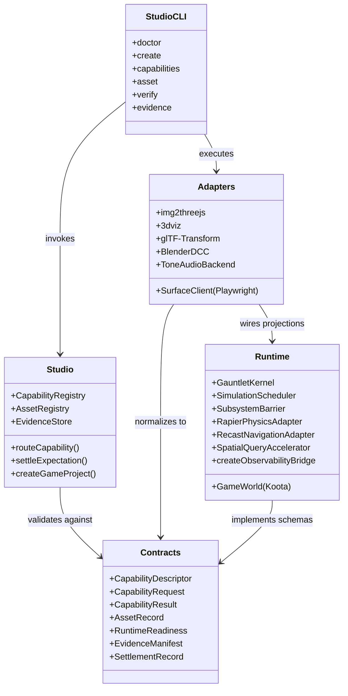
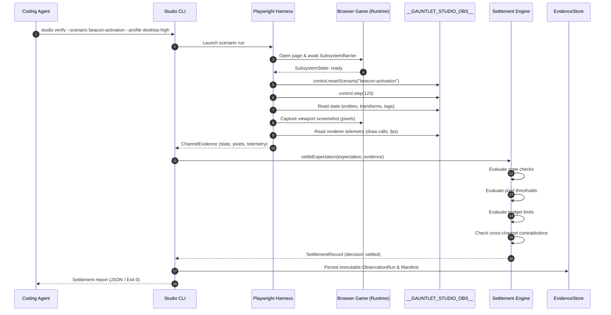

# Gauntlet Game Studio Architecture

Gauntlet Game Studio is an agentic development studio and first-party runtime environment for building polished, verifiable browser-native 3D games. It routes game requirements to narrow specialist capabilities, executes gameplay on a first-party runtime, and verifies completion through evidence-backed Gauntlet settlement observing **state, pixels, and telemetry**.

---

## 1. System Identity & Mission

### System Definition
> **Gauntlet Game Studio turns a game specification and authorized references into an independently buildable, observable browser game whose gameplay, visual, and runtime integrity are settled by reproducible tri-channel evidence rather than generator assertion.**

### Core Problems Solved
1. **Competing Sources of Truth**: In typical agentic development, coding agents conflate visual scene graphs (`THREE.Scene`), physics bodies (`Rapier`), or DCC scenes (`Blender`) with game semantics, leading to corrupted quest logic and brittle state.
2. **Context & Tool Bloat**: Exposing whole DCC suites or monolithic game engines overwhelms agent context windows. The studio exposes **stable capability contracts**; specialist skills are loaded only after routing.
3. **Screenshot False Positives**: Plausible visuals often conceal frozen state machines, missing colliders, or memory leaks. Gauntlet enforces cross-channel consistency across **state**, **pixels**, and **telemetry**.

---

## 2. Logical Architecture vs. Physical / Runtime Topology

### Logical View
Logically, the studio operates as a unidirectional pipeline from high-level game intent to verified evidence:



### Physical / Runtime Package Topology
The repository is structured as a Bun 1.4 monorepo with 5 strictly bounded packages, an operator CLI, an example reference game, and an independent project template:

```text
gauntlet-game-studio/
├── packages/
│   ├── contracts/          # Provider-neutral Zod schemas and TypeScript types
│   ├── runtime/            # First-party engine: Koota ECS, Three.js, Rapier, Recast, Network
│   ├── studio/             # Capability registry, router, asset registry, evidence store, settlement
│   └── adapters/           # External tool bridges: img2threejs, 3dviz, glTF-Transform, Blender, Tone, Playwright
├── apps/
│   └── studio-cli/         # Semantic automation CLI ('studio')
├── examples/
│   └── blackwater-relay/   # Reference vertical slice game proving single-player and multiplayer
├── templates/
│   └── game/               # Decoupled scaffold for generated game projects
└── scripts/                # Mechanical governance and conformance gates
```

### Dependency Direction Rules
1. `@gauntlet/contracts` has **zero workspace dependencies**. It is the immutable contract layer.
2. `@gauntlet/runtime` depends **only on contracts** and pinned runtime libraries (`three`, `koota`, `@dimforge/rapier3d-compat`, `recast-navigation`, `three-mesh-bvh`). It never imports `@gauntlet/studio` or `@gauntlet/adapters`.
3. `@gauntlet/adapters` depends on `@gauntlet/contracts` and `@gauntlet/runtime`.
4. `@gauntlet/studio` depends on `@gauntlet/contracts`. (Its test suite uses `@gauntlet/adapters`).
5. `apps/studio-cli` composes `@gauntlet/studio`, `@gauntlet/contracts`, and `@gauntlet/adapters`.
6. Generated game projects consume published runtime/adapter libraries and are buildable outside the monorepo.

---

## 3. Core Architectural Invariants

Every subsystem in Gauntlet Game Studio must uphold these invariants:

### Invariant 1: Single Authoritative Three.js Graph
`three` is resolved strictly once across all monorepo packages and templates (`^0.170.0`). No adapter or skill may bundle or link an independent copy of Three.js. Verified by `scripts/verify-third-party.ts` and `scripts/check-traceability.py`.

### Invariant 2: Koota ECS is the Sole Semantic Authority
The authoritative game state lives exclusively in `GameWorld` (Koota ECS). Three.js `Object3D` hierarchies, Rapier rigid bodies, and Recast crowd agents are **one-way synchronized execution projections**. Direct mutation of Three.js objects to encode game state is strictly rejected at runtime via `GameWorld.assertValidSemanticData()` and `assertNoProviderObjectsInState()`.

### Invariant 3: Capability Routing Precedes Provider Selection
The studio exposes capabilities (`world.composition`, `asset.reconstruct`, `dcc.blender.process`), not vendor names. Provider selection happens below the capability contract. Specialist skills are progressively disclosed; upstream director agents (e.g. `threejs-game-director`) are forbidden from owning orchestration.

### Invariant 4: Production Asset Records & Provenance
Every asset committed to a game project requires an `AssetRecord` in `AssetRegistry`. It tracks origin (`user`, `project`, `cc0`, `licensed`, `generated`, `blender`, `procedural`), license, SHA-256 hash, budgets, and append-only acceptance/rejection history. Reference images are distinguished from shipped source material.

### Invariant 5: Headless Purity & Subsystem Readiness
The runtime simulation kernel (`GauntletKernel`, `ServerRuntime`) is pure headless: it imports and runs without DOM, WebGL, or AudioContext. Subsystems with asynchronous initialization (Rapier WASM, Recast, Network, Audio) are synchronized behind a deterministic `SubsystemBarrier`. Scenarios cannot advance while subsystems are booting.

### Invariant 6: Observability Production Hardening
Development and test builds expose `window.__GAUNTLET_STUDIO_OBS__` (v1) with full inspection and privileged controls (`pause`, `resume`, `step`, `resetScenario`, `setSeed`). Production builds strip the `control` namespace entirely. `inspectProductionSurface()` enforces that no privileged control or mutation API leaks into production.

### Invariant 7: Tri-Channel Gauntlet Settlement
A capability claim or scenario is not settled until verified across three required channels:
- **State**: Authoritative entity traits and component transitions.
- **Pixels**: Deterministic viewport renders meeting visual criteria.
- **Telemetry**: Frame time, draw call, triangle, and memory budgets.
Cross-channel contradictions (such as `pixels_pass_state_fail`) trigger immediate rejection.

### Invariant 8: Single Step Owner per Tick
Authoritative game logic is stepped exactly once per fixed simulation tick via `SimulationScheduler.executeStepOwner()`. Secondary schedulers or duplicate stepping calls trigger `MultipleSchedulerError` or `DuplicateStepOwnerError`.

---

## 4. Subsystem Decomposition



---

## 5. Execution Traces & Data Flows

### The Gauntlet Settlement Loop
The primary feedback loop for all material changes:



---

## 6. Source Trail

- **Contracts & Schemas**: [`packages/contracts/src/schemas.ts`](file:///home/sprime01/projects/gauntlet-game-studio/packages/contracts/src/schemas.ts), [`packages/contracts/src/types.ts`](file:///home/sprime01/projects/gauntlet-game-studio/packages/contracts/src/types.ts)
- **Runtime Kernel & Scheduler**: [`packages/runtime/src/kernel.ts`](file:///home/sprime01/projects/gauntlet-game-studio/packages/runtime/src/kernel.ts), [`packages/runtime/src/scheduler.ts`](file:///home/sprime01/projects/gauntlet-game-studio/packages/runtime/src/scheduler.ts)
- **State Authority**: [`packages/runtime/src/state/world.ts`](file:///home/sprime01/projects/gauntlet-game-studio/packages/runtime/src/state/world.ts), [`packages/runtime/src/state/traits.ts`](file:///home/sprime01/projects/gauntlet-game-studio/packages/runtime/src/state/traits.ts)
- **Observability Bridge**: [`packages/runtime/src/observability/bridge.ts`](file:///home/sprime01/projects/gauntlet-game-studio/packages/runtime/src/observability/bridge.ts), [`packages/runtime/src/observability/contract.ts`](file:///home/sprime01/projects/gauntlet-game-studio/packages/runtime/src/observability/contract.ts)
- **Capability Router**: [`packages/studio/src/router/router.ts`](file:///home/sprime01/projects/gauntlet-game-studio/packages/studio/src/router/router.ts), [`packages/studio/src/capabilities/catalog.ts`](file:///home/sprime01/projects/gauntlet-game-studio/packages/studio/src/capabilities/catalog.ts)
- **Asset Registry**: [`packages/studio/src/assets/registry.ts`](file:///home/sprime01/projects/gauntlet-game-studio/packages/studio/src/assets/registry.ts), [`packages/studio/src/assets/gates.ts`](file:///home/sprime01/projects/gauntlet-game-studio/packages/studio/src/assets/gates.ts)
- **Settlement Engine**: [`packages/studio/src/gauntlet/settle.ts`](file:///home/sprime01/projects/gauntlet-game-studio/packages/studio/src/gauntlet/settle.ts), [`packages/studio/src/gauntlet/checks.ts`](file:///home/sprime01/projects/gauntlet-game-studio/packages/studio/src/gauntlet/checks.ts)
- **Reference Game Assembly**: [`examples/blackwater-relay/src/game/build.ts`](file:///home/sprime01/projects/gauntlet-game-studio/examples/blackwater-relay/src/game/build.ts), [`examples/blackwater-relay/src/game/browser.ts`](file:///home/sprime01/projects/gauntlet-game-studio/examples/blackwater-relay/src/game/browser.ts)
