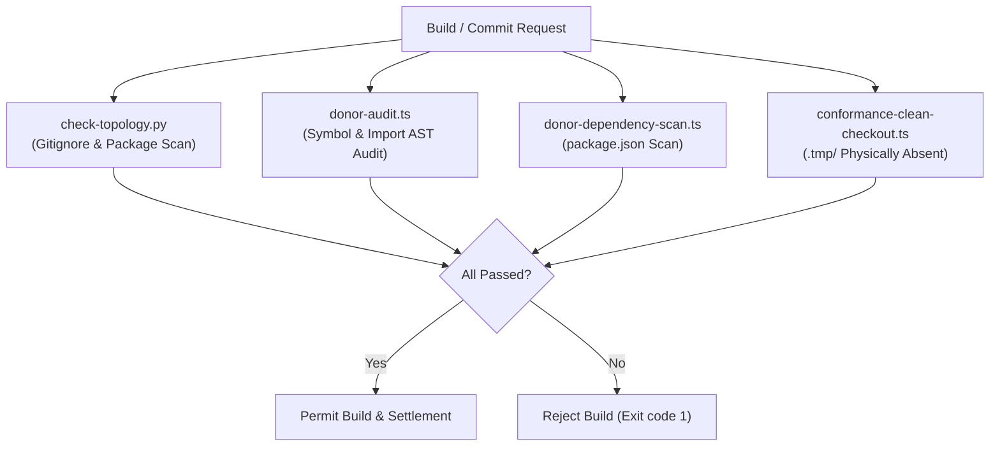

# Architectural Explanation: Donor Isolation & Repository Governance

This document explains the architectural governance, legal attribution, and mechanical boundary enforcement applied when mining code from open-source donor engines—specifically the Mavon Engine donor workspace.

---

## 1. The Code Donor Trap

When bootstrapping complex engines or toolchains, software teams often incorporate code from open-source projects ("donors"). If unconstrained, this introduces severe architectural debt:
1. **Architectural Drift**: The donor engine's architectural assumptions (e.g. monolithic `GameObject` trees, actor hierarchies) slowly spread into the new codebase.
2. **Hidden Dependencies**: Packages begin importing donor utilities, creating implicit coupling that makes updates impossible.
3. **Legal & Licensing Ambiguity**: Unclear source provenance risks copyright violations or missing attribution.
4. **Build Fragility**: Clean CI checkouts fail because local development accidentally relied on uncommitted files in the donor directory.

---

## 2. The Mavon Donor Experience

During early development, Gauntlet Game Studio designated the Mavon Engine (`MavonEngine/Core @ 20d4a4db`, MIT license) as a temporary, non-authoritative code donor located in `.tmp/donor/`.

The studio established strict rules:
- **Mechanisms, Not Architecture**: Only narrow, requirement-serving algorithms were transplanted (specifically, `BandwidthTracker` and `LatencySimulator`).
- **White-Label Adaptation**: Transplanted algorithms were adapted into first-party TypeScript files in `packages/runtime/src/diagnostics/` under Gauntlet contracts.
- **Architectural Rejection**: Mavon's core abstractions (`GameObject`, `BaseWorld`, `Actor`, `LivingActor`) were explicitly **rejected** from ever becoming runtime authorities.
- **Strict Legal Attribution**: Donor revision, commit hash, license, and file origins were committed to [`third_party/mavon-engine/PROVENANCE.md`](file:///home/sprime01/projects/gauntlet-game-studio/third_party/mavon-engine/PROVENANCE.md) and [`THIRD_PARTY_NOTICES.md`](file:///home/sprime01/projects/gauntlet-game-studio/THIRD_PARTY_NOTICES.md).

---

## 3. Mechanical Gate Enforcement

Rather than trusting developers or agents to obey prose guidelines, donor isolation is enforced by multiple mechanical scripts in CI:



### Gate 1: Topology Check (`scripts/check-topology.py`)
- Verifies `.tmp/` is present in `.gitignore`.
- Verifies no `package.json` workspace glob includes `.tmp` or `donor`.
- Checks all workspace dependencies for any mention of donor packages.

### Gate 2: AST Import Audit (`scripts/donor-audit.ts`)
- Recursively parses all TypeScript files in `packages/`, `apps/`, and `examples/`.
- Fails the build if any import path references `.tmp`, `donor`, or `mavon`.
- Scans for donor symbol leaks (e.g. `GameObject`, `BaseWorld`).

### Gate 3: Dependency Scan (`scripts/donor-dependency-scan.ts`)
- Inspects all package manifests across the monorepo to ensure zero dependencies or devDependencies point to donor source.

### Gate 4: Clean Checkout Conformance (`scripts/conformance-clean-checkout.ts`)
- Runs in CI with `.tmp/donor/` physically removed from disk.
- Compiles the entire monorepo (`bun run check`), runs all tests (`bun test`), builds Blackwater Relay, and executes browser scenarios.
- Proves that the entire studio functions cleanly without the donor present.

---

## 4. Runtime Guardrails

Even if an unauthorized donor object bypassed build-time AST scanners, the runtime actively protects itself.

In [`packages/runtime/src/state/world.ts`](file:///home/sprime01/projects/gauntlet-game-studio/packages/runtime/src/state/world.ts#L331):
```typescript
const forbiddenConstructors = [
  "GameObject", "BaseWorld", "Actor", "LivingActor", ...
];
this.scanForForbiddenObjects(obj, entityId, forbiddenConstructors);
```
Attempting to pass any donor object into Koota ECS triggers immediate runtime failure.

---

## 5. Source Trail

- **Donor Provenance Record**: [`third_party/mavon-engine/PROVENANCE.md`](file:///home/sprime01/projects/gauntlet-game-studio/third_party/mavon-engine/PROVENANCE.md)
- **Third Party Notices**: [`THIRD_PARTY_NOTICES.md`](file:///home/sprime01/projects/gauntlet-game-studio/THIRD_PARTY_NOTICES.md)
- **Topology Check**: [`scripts/check-topology.py`](file:///home/sprime01/projects/gauntlet-game-studio/scripts/check-topology.py)
- **Donor Audit**: [`scripts/donor-audit.ts`](file:///home/sprime01/projects/gauntlet-game-studio/scripts/donor-audit.ts)
- **Dependency Scan**: [`scripts/donor-dependency-scan.ts`](file:///home/sprime01/projects/gauntlet-game-studio/scripts/donor-dependency-scan.ts)
- **Clean Checkout Script**: [`scripts/conformance-clean-checkout.ts`](file:///home/sprime01/projects/gauntlet-game-studio/scripts/conformance-clean-checkout.ts)
- **Donor Isolation Unit Tests**: [`packages/runtime/test/donor-isolation.test.ts`](file:///home/sprime01/projects/gauntlet-game-studio/packages/runtime/test/donor-isolation.test.ts)
