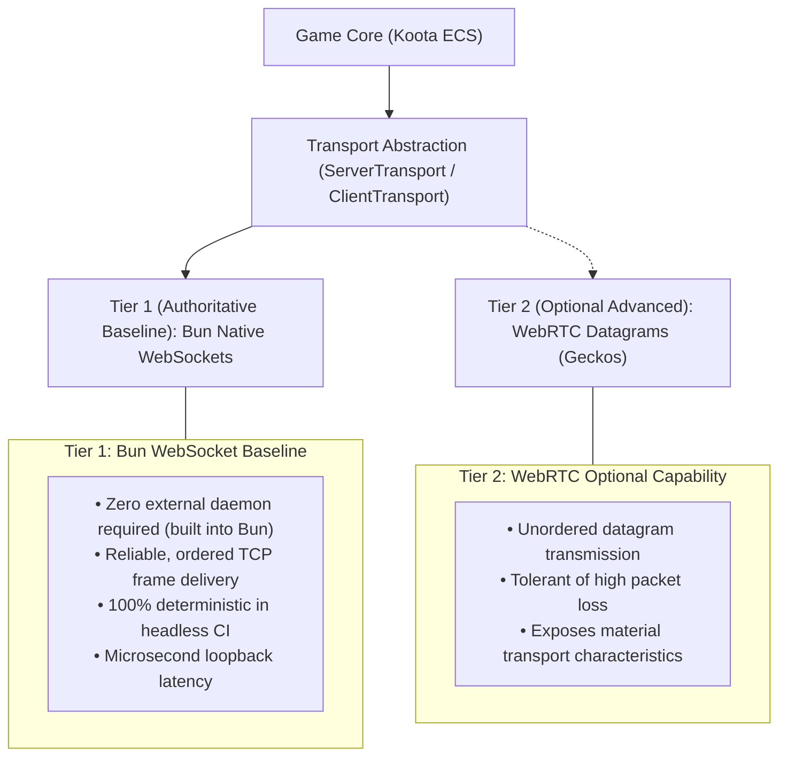
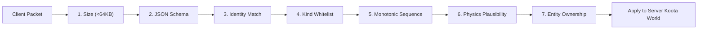

# Architectural Explanation: Multiplayer Transport Strategy

This document details the design decisions behind the Gauntlet Runtime's multiplayer architecture: why Bun native WebSockets serve as the reliable baseline transport, how WebRTC datagrams are treated as an optional capability, how single-player builds are guaranteed zero network overhead, and how server-side validation enforces security.

---

## 1. The Real-Time Browser Networking Dilemma

Real-time multiplayer browser games require two conflicting network characteristics:
1. **Low Latency & Unreliable Datagrams**: Fast-paced movement benefits from UDP-like datagrams (WebRTC data channels / Geckos.io) where dropped packets are discarded rather than blocking subsequent frames (avoiding head-of-line blocking).
2. **Reliability, Portability & Tooling Simplicity**: WebRTC requires complex signaling servers, ICE/STUN/TURN infrastructure, and browser certificate handshakes. In automated headless CI environments and containerized test runners, WebRTC often fails due to firewall restrictions, UDP port blocking, or missing native dependencies.

---

## 2. The Multi-Tier Transport Strategy

Gauntlet Game Studio resolves this tension by adopting a **two-tier transport architecture**:

### Tier 1: Bun Native WebSockets (Baseline)
- The primary multiplayer implementation in [`packages/runtime/src/network/transport-ws.ts`](file:///home/sprime01/projects/gauntlet-game-studio/packages/runtime/src/network/transport-ws.ts) binds Bun's native WebSocket engine (`Bun.serve({ websocket: ... })`).
- Runs directly inside the headless server process without requiring third-party native C++ build tools or external signaling servers.
- Fully compatible with standard browser `WebSocket` APIs.
- Serves as the required baseline for all monorepo test suites and CI conformance gates.

### Tier 2: WebRTC Datagrams (Optional Capability)
- Implemented as an optional adapter via Geckos.io (`network.geckos`).
- Exposes material transport characteristics (packet loss, out-of-order delivery, jitter).
- Gated behind explicit environment availability: if WebRTC or UDP sockets are unavailable in a restricted CI environment, Gauntlet cleanly reports `browser_proof_unavailable` rather than a crash.

---

## 3. The Single-Player Zero-Network Guarantee

A frequent failure mode in modern game frameworks is the "networked-by-default" architecture, where single-player games carry the overhead of local loopback sockets, serialization loops, and asynchronous tick delays.

Gauntlet Game Studio enforces the **Single-Player Zero-Network Guarantee**:
- When a game is declared as single-player (such as Blackwater Relay's default mode), the `network` subsystem is **completely omitted** from `SubsystemBarrier`.
- No WebSocket or WebRTC sockets are created.
- The game loop steps directly in memory with zero serialization overhead.
- In `examples/blackwater-relay`, the adversarial test `scripts/teeth-network-disabled.ts` deliberately poisons and deletes all browser and Node network APIs (`WebSocket`, `fetch`, `XMLHttpRequest`); all six single-player scenarios still compile, run, and pass with 100% green evidence.

---

## 4. Server-Side Security & Validation Pipeline

In multiplayer mode, clients cannot be trusted. Gauntlet enforces a strict **validation-before-mutation** pipeline on the server before applying inputs to Koota:

1. **Size check**: Messages exceeding 64 KiB are dropped immediately.
2. **Contract check**: Messages must validate against `NetworkEnvelopeSchema`.
3. **Identity check**: A client cannot forge another client's `client_id`.
4. **Sequence check**: Out-of-sequence or replayed commands are rejected.
5. **Physics plausibility**: Movement commands cannot exceed `maxSpeed * dt`. Speed-hacks and teleportation exploits are rejected before Koota state mutation.

---

## 5. Source Trail

- **Authoritative Server**: [`packages/runtime/src/network/server.ts`](file:///home/sprime01/projects/gauntlet-game-studio/packages/runtime/src/network/server.ts)
- **Bun WebSocket Transport**: [`packages/runtime/src/network/transport-ws.ts`](file:///home/sprime01/projects/gauntlet-game-studio/packages/runtime/src/network/transport-ws.ts)
- **Protocol Validation**: [`packages/runtime/src/network/protocol.ts`](file:///home/sprime01/projects/gauntlet-game-studio/packages/runtime/src/network/protocol.ts)
- **Interest Filter**: [`packages/runtime/src/network/interest.ts`](file:///home/sprime01/projects/gauntlet-game-studio/packages/runtime/src/network/interest.ts)
- **Network Tests**: [`packages/runtime/test/network/`](file:///home/sprime01/projects/gauntlet-game-studio/packages/runtime/test/network/)
- **Network Disabled Tooth Check**: [`examples/blackwater-relay/scripts/teeth-network-disabled.ts`](file:///home/sprime01/projects/gauntlet-game-studio/examples/blackwater-relay/scripts/teeth-network-disabled.ts)
