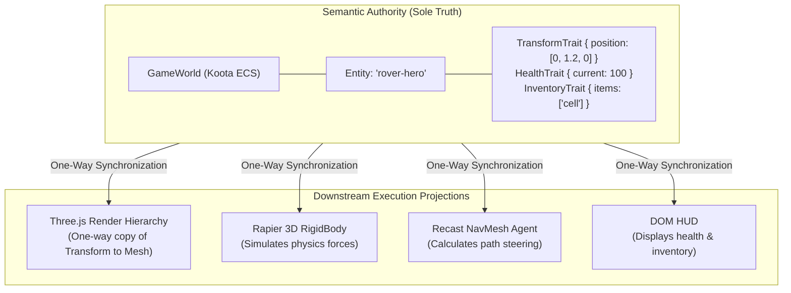

# Architectural Explanation: Semantic Authority vs. Scene Graph

This document explains the foundational architectural decision in Gauntlet Game Studio: why authoritative gameplay semantics reside exclusively in an Entity Component System (Koota ECS), and why the Three.js scene graph, Rapier physics simulation, and Recast navigation data are treated strictly as subordinate execution projections.

---

## 1. The Core Tension

In traditional game development tutorials and naive agentic coding workflows, Three.js `Object3D` hierarchies are frequently used as the game's data model:
```typescript
// Typical anti-pattern:
const playerMesh = new THREE.Mesh(geometry, material);
playerMesh.userData.health = 100;
playerMesh.userData.inventory = ["keycard"];
scene.add(playerMesh);
```

While convenient for small demos, this pattern breaks down catastrophically as a game grows or when autonomous coding agents develop systems:

1. **Destruction Cascades**: In 3D graphics, visual objects are regularly created, pooled, culled, LOD-swapped, or disposed (e.g., when an entity moves out of camera frustum or is destroyed in an explosion). If gameplay state lives on `userData`, destroying a render mesh destroys game memory.
2. **Coupling to the DOM and WebGL**: Three.js objects inherently reference GPU contexts, buffers, and textures. When state lives in the scene graph, running automated tests requires spinning up virtual WebGL contexts (`headless-gl`) or full browser instances. High-speed headless simulation testing becomes impossible.
3. **Competing Truths**: Physics engines maintain their own rigid body hierarchy; navigation engines maintain navmesh polygons; animation systems maintain bone matrices. When multiple subsystems think they own the position or orientation of an object, subtle race conditions and jitter occur.

---

## 2. The Projection Pattern Solution

Gauntlet Game Studio strictly separates **Authoritative Truth** from **Execution Projections**:



### The Invariant
> **Koota is the sole semantic authority. Three.js, Rapier, Recast, Tone.js, and the DOM are one-way synchronized execution projections.**

---

## 3. Concrete Implementation & Enforcement

This invariant is not merely an architectural guideline; it is mechanically enforced at runtime.

### Runtime Leak Auditing (`GameWorld.assertValidSemanticData`)
In [`packages/runtime/src/state/world.ts`](file:///home/sprime01/projects/gauntlet-game-studio/packages/runtime/src/state/world.ts#L331), `GameWorld` actively scans entity traits during mutation and snapshotting:
```typescript
public assertValidSemanticData(obj: any, entityId = "state-entity"): void {
  const forbiddenConstructors = [
    "Object3D", "Mesh", "Group", "Scene", "Camera", "PerspectiveCamera",
    "RigidBody", "Collider", "World", "Crowd", "NavMesh",
    "Element", "HTMLElement", "HTMLCanvasElement", "AudioContext",
    "GameObject", "BaseWorld", "Actor", "LivingActor"
  ];
  this.scanForForbiddenObjects(obj, entityId, forbiddenConstructors);
}
```
If an agent attempts to store a `THREE.Mesh` or a Rapier `RigidBody` inside a Koota trait, the runtime immediately throws an exception.

### Stable ID Correlation
Entities possess a unique string identifier (`EntityId`). Downstream projections do not hold direct pointers to each other; they hold handles referencing the entity ID:
- `RenderProjectionHandle({ handleId: "mesh-rover-hero" })`
- `PhysicsProjectionHandle({ handleId: "body-rover-hero" })`
- `NavigationProjectionHandle({ handleId: "agent-drone-1" })`

[`ProjectionRegistry`](file:///home/sprime01/projects/gauntlet-game-studio/packages/runtime/src/projections/registry.ts) correlates these handles. If the Three.js mesh needs to be rebuilt or disposed (e.g. swapping from low-poly to high-poly), the Koota entity remains completely untouched.

---

## 4. Architectural Consequences & Trade-Offs

### Positive Consequences
1. **Headless Execution**: The entire simulation (physics, navigation, game rules, combat, multiplayer replication) can run in a headless Bun script without WebGL or canvas. Unit tests execute hundreds of ticks in under 50ms.
2. **Crash Resilience**: Rendering errors or shader compilation failures in WebGL do not crash or corrupt the game's simulation loop.
3. **Clean Multiplayer Replication**: Serializing game state for network transmission is trivial: `GameWorld.takeSemanticSnapshot()` dumps plain JSON-safe arrays of traits, with zero risk of circular GPU references.

### Trade-Offs & Costs
1. **Copying Overhead**: Coordinates must be copied from Koota to Three.js `Object3D` instances once per tick. In practice, benchmarking in `examples/blackwater-relay` proves this takes `< 0.2ms` for hundreds of entities, easily fitting into 16.6ms frame budgets.
2. **Indirection**: Developers cannot simply call `mesh.position.x += 1`. They must update the Koota `Transform` trait. This discipline requires understanding the system mental model, which is why orientation documentation is critical.

---

## 5. Source Trail

- **State Container & Leak Scanner**: [`packages/runtime/src/state/world.ts`](file:///home/sprime01/projects/gauntlet-game-studio/packages/runtime/src/state/world.ts)
- **Trait Definitions**: [`packages/runtime/src/state/traits.ts`](file:///home/sprime01/projects/gauntlet-game-studio/packages/runtime/src/state/traits.ts)
- **Render Projection Manager**: [`packages/runtime/src/projections/render.ts`](file:///home/sprime01/projects/gauntlet-game-studio/packages/runtime/src/projections/render.ts)
- **Authority Unit Tests**: [`packages/runtime/test/authority.test.ts`](file:///home/sprime01/projects/gauntlet-game-studio/packages/runtime/test/authority.test.ts)
