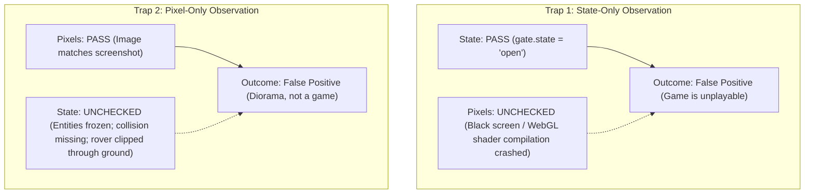
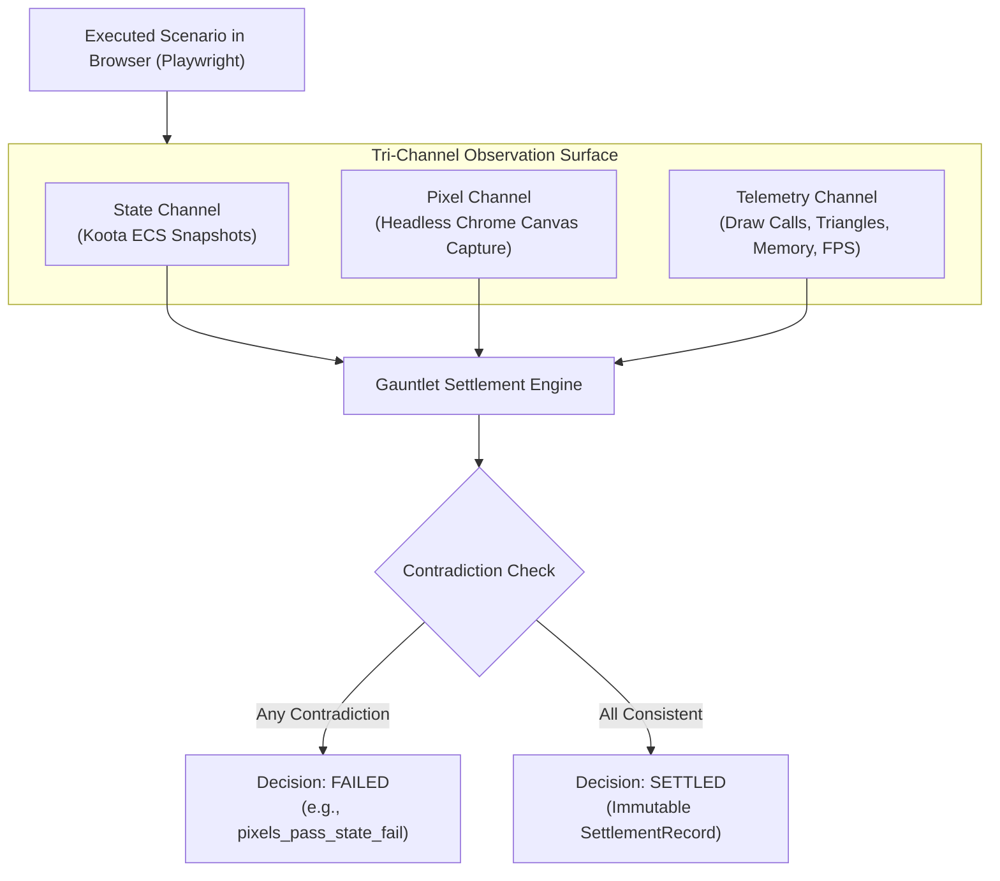

# Architectural Explanation: Tri-Channel Verification Theory

This document explains the verification philosophy behind the Gauntlet settlement engine: why browser game development requires independent observation across state, pixels, and telemetry, and why a claim cannot settle when one required channel contradicts another.

---

## 1. The Single-Channel Failure Fallacy

Most automated testing frameworks in web development observe only a single channel of execution:
- **Unit & Integration Tests**: Observe **semantic state** (e.g., asserting that `gameState.isDoorOpen === true`).
- **Visual Regression Tests**: Observe **pixels** (e.g., comparing a canvas screenshot against a baseline image).
- **Lighthouse / Profiling Tests**: Observe **telemetry** (e.g., checking frame rate or DOM load times).

In browser-native 3D games, single-channel observation produces disastrous false successes:

A visually convincing screenshot can be generated by a completely broken game—such as an empty scene with an un-animated static mesh placed at camera origin. Conversely, unit tests can report 100% green while the user sees nothing.

---

## 2. The Tri-Channel Settlement Model

Gauntlet Game Studio requires that settlement-critical claims be observed across all three channels simultaneously:

### Channel Definitions & Roles

1. **State Channel (Authoritative Truth)**:
   - Evaluates authoritative entity traits in Koota ECS via the observability bridge (`surface.entities.snapshot()`).
   - Verifies logic: Did health decrease? Did the objective transition to `delivered`? Did the rover reach the coordinate threshold?
2. **Pixel Channel (Visible Consequence)**:
   - Evaluates the rendered viewport via Playwright `page.screenshot()`.
   - Verifies visual reality: Is the beacon lamp visibly emissive? Is the sky shader rendering correctly? Is the rover visible to the camera?
3. **Telemetry Channel (Performance & Budget Reality)**:
   - Evaluates WebGL renderer statistics and browser performance metrics.
   - Verifies engineering budgets: Are draw calls under budget? Are triangles under budget? Did frame time remain within 16.6ms?

---

## 3. Cross-Channel Contradiction Detection

Gauntlet does not simply sum test scores; it actively checks for **cross-channel contradictions** in [`packages/studio/src/gauntlet/checks.ts`](file:///home/sprime01/projects/gauntlet-game-studio/packages/studio/src/gauntlet/checks.ts):

### `pixels_pass_state_fail`
- **Condition**: The visual screenshot satisfies luminance or image comparison thresholds, but Koota entity state reports the action never completed.
- **Root Cause**: Visual animation running without semantic state mutation, client-side prediction desynchronization, or visual mock objects remaining in the scene.
- **Settlement Action**: Immediate failure. Pixels can never override authoritative state truth.

### `state_pass_pixels_fail`
- **Condition**: Koota state reports `gate: open` and `beacon: active`, but the rendered canvas is dark or obscured.
- **Root Cause**: WebGL shader failure, camera pointing the wrong way, missing material bindings, or projection detachment.
- **Settlement Action**: Immediate failure. Semantic state without visual consequence is not a playable game.

---

## 4. Structural vs. Hardware-Sensitive Budgets

Performance verification in CI environments is notoriously brittle because cloud test runners (e.g. GitHub Actions runners without discrete GPUs) use software WebGL rasterizers (`SwiftShader` / `llvmpipe`).

Gauntlet addresses this by separating budgets in [`packages/studio/src/quality/profiles.ts`](file:///home/sprime01/projects/gauntlet-game-studio/packages/studio/src/quality/profiles.ts):
1. **Structural Budgets (Deterministic CI Gates)**:
   - Triangle count (`<= 50,000`)
   - Draw call count (`<= 45`)
   - Texture memory bytes (`<= 32MB`)
   - Unused material count (`0`)
   *These metrics are 100% deterministic and hardware-independent.*
2. **Hardware-Sensitive Budgets (Target Profile Gates)**:
   - Frame time 95th percentile (`<= 16.6ms`)
   - Average FPS (`>= 55`)
   *Gated against target hardware profiles (`desktop-high`, `desktop-low`, `mobile`). If running on a software renderer, hardware-sensitive gates degrade gracefully with diagnostic notices rather than false build breaks.*

---

## 5. Immutable Evidence & Revision Hashing

A settlement claim must not rely on historical memory or transient logs.
- Every verification run generates a unique `ObservationRun` tied to the project's exact git commit SHA (`resolveProjectRevision()`).
- The collected artifacts (screenshots, state dumps, performance logs) are bound into an `EvidenceManifest` with SHA-256 checksums.
- Manifests and settlement records are saved to disk in `artifacts/runs/<run_id>/` and are append-only.
- In clean CI checkouts, attempts to substitute historical proof runs from other revisions fail the settlement gate.

---

## 6. Source Trail

- **Settlement Engine**: [`packages/studio/src/gauntlet/settle.ts`](file:///home/sprime01/projects/gauntlet-game-studio/packages/studio/src/gauntlet/settle.ts)
- **Channel Check Implementation**: [`packages/studio/src/gauntlet/checks.ts`](file:///home/sprime01/projects/gauntlet-game-studio/packages/studio/src/gauntlet/checks.ts)
- **Expectation Schemas**: [`packages/studio/src/gauntlet/expectation.ts`](file:///home/sprime01/projects/gauntlet-game-studio/packages/studio/src/gauntlet/expectation.ts)
- **Quality Profiles**: [`packages/studio/src/quality/profiles.ts`](file:///home/sprime01/projects/gauntlet-game-studio/packages/studio/src/quality/profiles.ts)
- **Evidence Store**: [`packages/studio/src/evidence/store.ts`](file:///home/sprime01/projects/gauntlet-game-studio/packages/studio/src/evidence/store.ts)
- **Settlement Tests**: [`packages/studio/test/proof/`](file:///home/sprime01/projects/gauntlet-game-studio/packages/studio/test/proof/)
