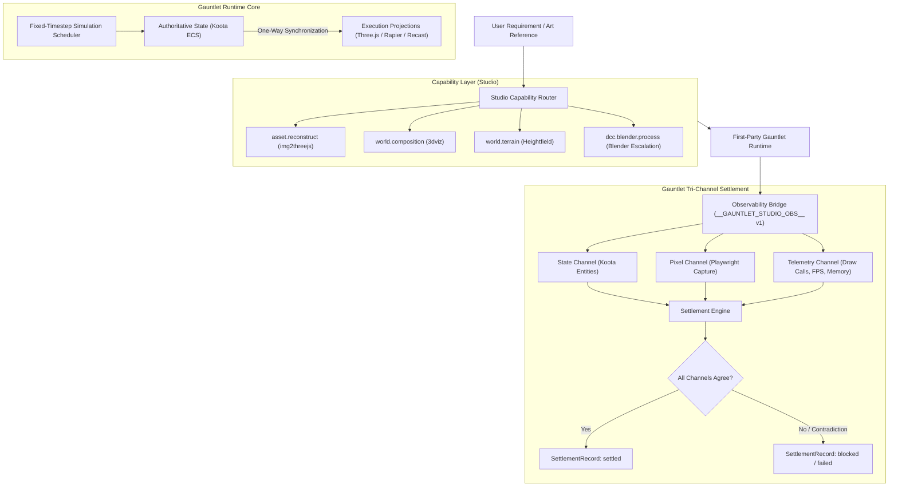

# Gauntlet Game Studio Documentation

Welcome to the technical documentation system for **Gauntlet Game Studio**. This documentation is designed as a self-contained knowledge map connecting high-level concepts and mental models directly down to concrete TypeScript implementations, contracts, and test evidence.

---

## What Gauntlet Game Studio Is

Gauntlet Game Studio is an agentic development studio and first-party runtime environment for building polished, verifiable browser-native 3D games. It turns game requirements and reference imagery into independently buildable game projects without allowing visual scene graphs, physics engines, or DCC tools to corrupt authoritative gameplay semantics.

The studio operates on a core development principle:
> **A game feature is not complete because an agent generated code, a process started once, or a screenshot looks plausible. It is complete only when the game proves its consequence across authoritative state, rendered pixels, and runtime telemetry.**

---

## The System in One Picture

---

## The 6 Concepts You Need First

1. **Capability**: A stable, provider-neutral studio affordance (e.g. `asset.reconstruct`, `world.composition`). The game requests a capability; the studio selects the provider below the contract.
2. **Semantic Authority**: The absolute source of gameplay truth. In Gauntlet, this is exclusively **Koota ECS** (`GameWorld`).
3. **Execution Projection**: A derived, one-way synchronized representation of game state. Three.js scenes, Rapier rigid bodies, and Recast navmesh agents are projections, never authorities.
4. **AssetRecord**: The immutable production identity of an asset, recording provenance, origin class (`user`, `cc0`, `blender`, etc.), runtime representation, and append-only acceptance history.
5. **Observability Bridge**: A standardized browser window interface (`window.__GAUNTLET_STUDIO_OBS__` v1) exposing state reads, renderer probes, and dev/test controls. Stripped of mutation controls in production.
6. **Tri-Channel Settlement**: Verifying game increments across **state** (did the objective state flip?), **pixels** (is the beacon visibly glowing?), and **telemetry** (did frame time stay under budget?).

---

## A Representative Journey: Adding a Composed Prop

Suppose a game requires an interactive power cell sitting on terrain:

1. **Requirement Ingestion**: An agent submits a `CapabilityRequest` for `asset.reconstruct.reference-image` with a reference photo.
2. **Capability Routing**: The router validates positive triggers and negative affordances, choosing the `img2threejs` adapter.
3. **Procedural Assembly**: The adapter generates a procedural Three.js module exposing standardized semantic nodes (`socket_handle`, `connector`).
4. **Asset Intake**: The asset is registered in `AssetRegistry` with an `AssetRecord`, license provenance, and bounding box budget.
5. **Runtime Entity Spawning**: `GameWorld.spawnEntity()` instantiates the cell in Koota with `Transform`, `ItemTag`, and `RenderProjectionHandle`.
6. **Projection Sync**: `RenderProjectionManager` attaches the Three.js mesh; `RapierPhysicsAdapter` attaches a static sensor collider.
7. **Observation & Settlement**: Playwright runs a scenario advancing 60 ticks, reads the Koota entity transform via the observability bridge, takes a screenshot, and submits evidence to `settleExpectation()`. Gauntlet settles the asset as `settled`.

---

## Where to Go Next

- **I want to understand the architecture**: Read [`docs/mental-model.md`](file:///home/sprime01/projects/gauntlet-game-studio/docs/mental-model.md) and [`architecture.md`](file:///home/sprime01/projects/gauntlet-game-studio/architecture.md).
- **I want to build my first game**: Follow the [First Game Project Tutorial](file:///home/sprime01/projects/gauntlet-game-studio/docs/tutorials/first-game-project.md).
- **I want to understand why Koota ECS owns state**: Read [Semantic Authority vs. Scene Graph](file:///home/sprime01/projects/gauntlet-game-studio/docs/explanation/semantic-authority-vs-scene-graph.md).
- **I want to add a capability**: Read [How to Add a New Capability](file:///home/sprime01/projects/gauntlet-game-studio/docs/how-to/add-new-capability.md).
- **I need the CLI reference**: Consult the [Studio CLI Reference](file:///home/sprime01/projects/gauntlet-game-studio/docs/reference/cli.md).
- **I need to navigate all pages**: View the [Documentation Map](file:///home/sprime01/projects/gauntlet-game-studio/documentation-map.md) and [Source Map](file:///home/sprime01/projects/gauntlet-game-studio/source-map.md).
