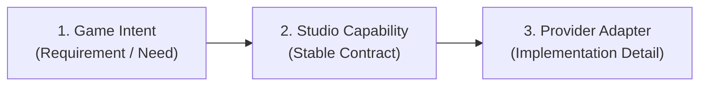
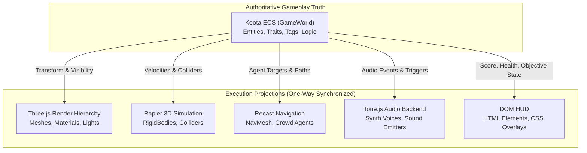
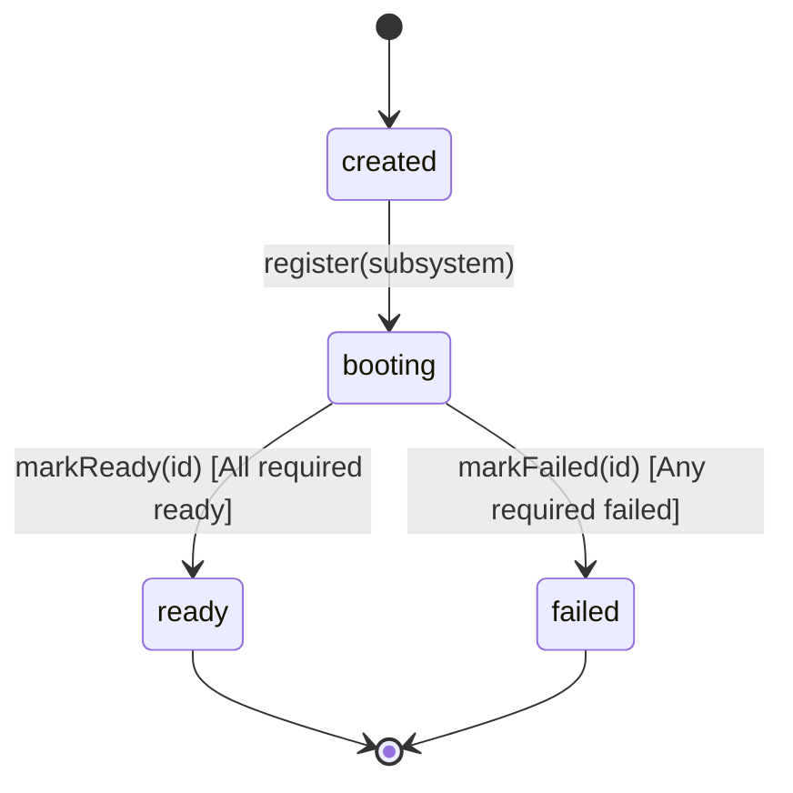

# System Mental Model

This document explains the conceptual structure of Gauntlet Game Studio. It provides the architectural mental model required to understand why subsystems are separated as they are, who owns authority during execution, and how developmental truth is established.

---

## 1. Intent vs. Capability vs. Provider

Traditional agent workflows tightly couple domain goals to specific vendor tools:
```text
Goal: "Build a mountain terrain" ──► Direct prompt: "Use three.terrain.js and Three.js"
```
This causes immediate brittleness: if the tool changes, the game's architecture breaks; if the agent misinterprets the tool's capabilities, it attempts impossible tasks (like using an image-to-3D tool for broad world layout).

Gauntlet Game Studio introduces a three-tier separation:



1. **Game Intent**: What the game mechanically or aesthetically requires (e.g., "deterministic elevation field with 4 octaves").
2. **Studio Capability**: A frozen, provider-neutral studio contract (e.g., `world.terrain`). The contract defines inputs, outputs, verification criteria, and explicit **negative affordances** ("do not use for scene composition").
3. **Provider**: The transient tool satisfying the contract (e.g., mathematical procedural elevation algorithm, `img2threejs`, `3dviz`, `glTF-Transform`).

The provider can be upgraded, swapped, or mocked without mutating the game's contracts or runtime logic.

---

## 2. Semantic Authority vs. Execution Projections

One of the most consequential architectural decisions in Gauntlet Game Studio is the **Projection Pattern**:



### Why This Separation Exists
- **Scene graphs are not databases**: In Three.js, destroying a `Mesh` or detaching an `Object3D` from a parent should never destroy a gameplay relationship (such as whether a quest item has been retrieved).
- **Physics engines are not game rules**: Rapier computes forces, velocities, and contacts. It does not know what a "player team" or "unlocked door" means.
- **Headless purity**: By decoupling Koota state from DOM, WebGL, and WebAudio, the entire simulation can execute deterministically in Node/Bun child processes, running thousands of ticks in milliseconds for automated testing.

### Projection Rules
1. **Unidirectional Flow**: State flows from Koota to projections. Projections do not mutate Koota directly; external events (e.g., a Rapier collision sensor trigger) are ingested as semantic commands or events and processed by the simulation scheduler.
2. **Stable ID Correlation**: Every entity possesses a unique, stable string identifier (`EntityId`). Projections register handles linked to this ID in the `ProjectionRegistry`.
3. **Purity Assertions**: `GameWorld.assertValidSemanticData()` actively scans Koota state at runtime. If any Three.js `Object3D`, Rapier `RigidBody`, or DOM element is injected into an entity trait, the runtime immediately throws an error.

---

## 3. The Tri-Channel Proof Concept

In browser game development, verification often falls into two traps:
1. **Assertion-only testing**: Unit tests check that a boolean flag is `true`, but the game screen is completely black or throwing unhandled WebGL shader errors.
2. **Screenshot-only testing**: Visual regression captures a plausible rendered image, but the player character has fallen through the floor, or the quest state machine is completely frozen.

Gauntlet eliminates these false positives by requiring **tri-channel observation**:

| Channel | What It Observes | Source of Truth | Example Check |
| :--- | :--- | :--- | :--- |
| **State** | Authoritative semantic truth | Koota ECS (`GameWorld`) | `entity("beacon").has(ActiveTag) === true` |
| **Pixels** | Visible rendered consequence | Headless Chrome Viewport | `mean_luminance > 0.4` at beacon coordinates |
| **Telemetry** | Runtime performance & budget | Chrome Performance & WebGL stats | `draw_calls <= 45`, `fps >= 55` |

### Cross-Channel Contradictions
A capability increment fails settlement if channels contradict each other:
- **`pixels_pass_state_fail`**: The screenshot appears to show an open gate, but the Koota entity state reports `gate: closed`. (Typically caused by client-side animation desynchronization or visual mock leaks).
- **`state_pass_pixels_fail`**: Koota reports the objective was completed and the beacon illuminated, but the screen is dark. (Caused by broken shaders, missing lights, or projection detachment).

---

## 4. Subsystem Readiness & Asynchronous Boot Barrier

Browser game runtimes compose multiple asynchronous subsystems:
- Rapier 3D requires initializing a WebAssembly module (`@dimforge/rapier3d-compat`).
- Recast Navigation requires compiling navigation meshes in WebAssembly.
- WebAudio / Tone.js requires waiting for a user gesture before the browser unlocks audio contexts.
- Multiplayer networking requires establishing WebSocket or WebRTC datagram handshakes.

If simulation ticks begin while these subsystems are half-initialized, race conditions occur.

Gauntlet introduces the `SubsystemBarrier`:

No scenario can be stepped, and no game logic can advance until `SubsystemBarrier.isReady()` returns `true`.

---

## 5. Single Simulation Scheduler & Step Ownership

To guarantee determinism in single-player simulation and client-side prediction, Gauntlet enforces a strict scheduling invariant:
- **One active scheduler**: `SimulationScheduler` maintains a singleton guard. Launching a second scheduler throws `MultipleSchedulerError`.
- **Fixed delta time**: Simulation steps occur at a fixed rate (default: 60Hz / 16.66ms).
- **Single Step Owner**: For each tick, exactly one registered step owner (e.g. `stepGame`) may mutate authoritative state via `SimulationScheduler.executeStepOwner()`. Secondary systems cannot step independently.

---

## Source Trail

- **Contract Definitions**: [`packages/contracts/src/schemas.ts`](file:///home/sprime01/projects/gauntlet-game-studio/packages/contracts/src/schemas.ts)
- **ECS & Authority**: [`packages/runtime/src/state/world.ts`](file:///home/sprime01/projects/gauntlet-game-studio/packages/runtime/src/state/world.ts)
- **Projections**: [`packages/runtime/src/projections/render.ts`](file:///home/sprime01/projects/gauntlet-game-studio/packages/runtime/src/projections/render.ts), [`packages/runtime/src/physics/rapier.ts`](file:///home/sprime01/projects/gauntlet-game-studio/packages/runtime/src/physics/rapier.ts)
- **Readiness Barrier**: [`packages/runtime/src/readiness.ts`](file:///home/sprime01/projects/gauntlet-game-studio/packages/runtime/src/readiness.ts)
- **Scheduler**: [`packages/runtime/src/scheduler.ts`](file:///home/sprime01/projects/gauntlet-game-studio/packages/runtime/src/scheduler.ts)
- **Gauntlet Settlement**: [`packages/studio/src/gauntlet/settle.ts`](file:///home/sprime01/projects/gauntlet-game-studio/packages/studio/src/gauntlet/settle.ts)
