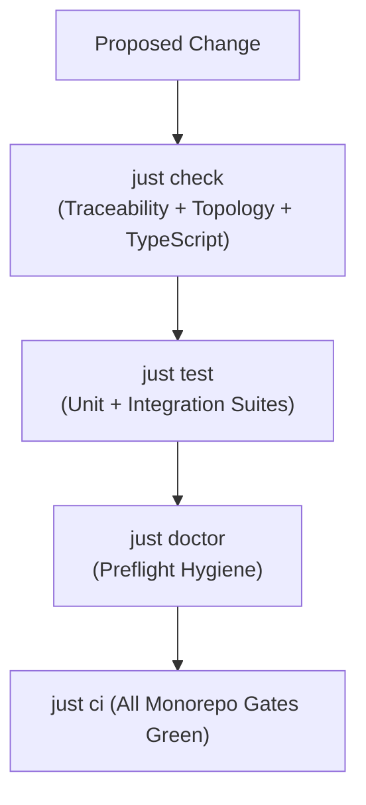

# Technical Reference: Verification Gates & CI Commands

This reference catalogues all automated verification gates, Justfile recipes, npm/bun package scripts, and mechanical compliance checkers in Gauntlet Game Studio.

---

## 1. Overview of Verification Discipline

Gauntlet Game Studio rejects the practice of declaring work complete based on model assertion or ad-hoc test output. All material changes must pass through **reproducible, mechanical verification gates**.



---

## 2. Operator Justfile Targets

The root [`justfile`](file:///home/sprime01/projects/gauntlet-game-studio/justfile) provides the canonical gate aliases:

| Target | Command Executed | Description | Gate Scope |
| :--- | :--- | :--- | :--- |
| `just validate-agent-artifacts` | `python3 scripts/check-traceability.py && python3 scripts/check-topology.py` | Validates spec/plan traceability, 193 unique IDs, DAG acyclicity, and monorepo topology boundaries. | Monorepo Governance |
| `just doctor` | `bun run studio -- doctor` | Executes preflight checks on Bun version, donor isolation, package manifests, and secret hygiene. | Environment |
| `just check` | `just validate-agent-artifacts && bun x tsc --noEmit` | Runs structural artifact checks and compiles TypeScript across all packages with zero emit errors. | Typecheck & Structure |
| `just test` | `just validate-agent-artifacts && bun test` | Runs artifact validation followed by the complete workspace unit and integration test battery. | Unit / Integration |
| `just lint` | `just validate-agent-artifacts && python3 py_compile scripts/...` | Compiles Python validation scripts to byte-code to ensure zero syntax regressions. | Script Syntax |
| `just ci` | `just check && just test && just lint && just validate-agent-artifacts && just doctor` | Aggregate gate binding all individual gates into a single CI verification target. | Comprehensive CI |

---

## 3. Specialized Conformance & Audit Scripts

The [`scripts/`](file:///home/sprime01/projects/gauntlet-game-studio/scripts/) directory contains targeted verification scripts:

### Specification & Monorepo Governance
- **`python3 scripts/check-traceability.py`**:
  - Verifies 100% multi-class traceability across all 152 REQ-* requirements, 14 VAR-* variations, 8 RECOV-* recovery cases, and 10 CLAIM-* claims.
  - Verifies SHA-256 match between `.agents/specs/gauntlet-game-studio.spec.yaml` and `.agents/plans/gauntlet-game-studio.plan.yaml`.
  - Proves the task dependency DAG is strictly acyclic.
- **`python3 scripts/check-topology.py`**:
  - Enforces that only the 5 approved packages exist in `packages/` and `apps/`.
  - Rejects adapter package proliferation (enforcing that adapters remain modules within `packages/adapters`).
  - Confirms `.tmp/` is present in `.gitignore`.

### Donor Isolation & Source Provenance
- **`bun run ./scripts/donor-audit.ts`** (`bun run donor:audit`):
  - Audits all TypeScript source files to ensure no imports reference `.tmp/`, `donor`, or Mavon Engine files.
- **`bun run ./scripts/donor-dependency-scan.ts`** (`bun run donor:dependency-scan`):
  - Scans all package manifests to guarantee zero donor dependencies exist.
- **`bun run ./scripts/conformance-clean-checkout.ts`** (`bun run conformance:clean-checkout`):
  - Verifies that a clean checkout compiles, tests, and builds cleanly with `.tmp/donor/` physically removed from disk.

### Security & Hardening
- **`bun run ./scripts/conformance-security.ts`** (`bun run conformance:security`):
  - Audits configuration parsing for secret leakage.
  - Runs `inspectProductionSurface()` to ensure the observability bridge strips all `control` mutation APIs in production builds.
  - Tests network protocol whitelisting and packet size limits.

### Error Recovery & Variations
- **`bun run ./scripts/conformance-recovery.ts`** (`bun run conformance:recovery`):
  - Automatically executes test fixtures for all 8 RECOV-* recovery cases (e.g., missing asset files, invalid seeds, offline browser proof, network packet corruption) and 14 VAR-* variation scenarios.

---

## 4. Package Test Suites

The monorepo contains targeted test suites executed via `bun test`:

| Test Suite Path | Package | Tests Run | Primary Subsystems Tested |
| :--- | :--- | :--- | :--- |
| `packages/contracts/src/*.test.ts` | `@gauntlet/contracts` | 25 tests | Zod schema validation, strict parsing, refinement logic |
| `packages/runtime/test/` | `@gauntlet/runtime` | 76 tests | Koota authority, scheduler, readiness barrier, physics, navigation, spatial BVH, observability bridge |
| `packages/runtime/test/network/` | `@gauntlet/runtime` | 29 tests | WebSocket transport, sequenced commands, Koota snapshot replication, interest management |
| `packages/studio/test/` | `@gauntlet/studio` | 68 tests | Capability routing, skill overlays, asset registry, quality profiles, expectation settlement |
| `packages/adapters/test/` | `@gauntlet/adapters` | 32 tests | img2threejs, glTF pipeline, Blender preflight, Tone audio unlock, Playwright runner |
| `examples/blackwater-relay/tests/` | `blackwater-relay` | 45 tests | Headless scenario progression, single-player zero-network, multiplayer client-server |

---

## 5. Running the Complete Verification Suite

To run all local gates and verify the entire repository:

```bash
# 1. Run all repository gates
just ci

# 2. Run donor isolation audits
bun run donor:audit
bun run donor:dependency-scan

# 3. Run conformance suites
bun run conformance:security
bun run conformance:clean-checkout
bun run conformance:recovery
```
