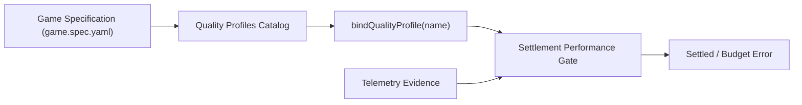

# Technical Reference: Quality Profiles & Performance Budgets

This reference defines the quality profile schema, hardware target budgets, and evaluation rules implemented in [`packages/studio/src/quality/`](file:///home/sprime01/projects/gauntlet-game-studio/packages/studio/src/quality/).

---

## 1. Quality Profile Architecture

Quality profiles define the hardware-sensitive and structural performance budgets that a game must satisfy during Gauntlet verification.

Game projects declare their quality profiles in their game specification (e.g. `examples/blackwater-relay/.agents/specs/game.spec.yaml`). The studio loads these profiles via `loadQualityProfiles()` and binds them to verification runs via `bindQualityProfile()`.



---

## 2. Standard Profile Specifications

Gauntlet Game Studio defines three baseline profiles:

| Budget Metric | `desktop-high` (Standard) | `desktop-low` (Integrated GPU) | `mobile` (Mobile Browser) | Type |
| :--- | :--- | :--- | :--- | :--- |
| **Max Triangles (Scene)** | `<= 60,000` | `<= 30,000` | `<= 15,000` | Structural |
| **Max Draw Calls** | `<= 50` | `<= 35` | `<= 25` | Structural |
| **Max Texture Memory** | `<= 64 MB` | `<= 32 MB` | `<= 16 MB` | Structural |
| **Max Geometry Memory**| `<= 16 MB` | `<= 8 MB` | `<= 4 MB` | Structural |
| **Max Hero Prop Triangles** | `<= 2,500` | `<= 1,200` | `<= 600` | Asset Gate |
| **Max Scenic Prop Triangles**| `<= 800` | `<= 400` | `<= 200` | Asset Gate |
| **Target FPS (Average)** | `>= 58.0` | `>= 50.0` | `>= 30.0` | Hardware-Sensitive |
| **Max Frame Time (p95)**| `<= 16.6 ms` | `<= 20.0 ms` | `<= 33.3 ms` | Hardware-Sensitive |

---

## 3. Evaluation Rules (`evaluatePerformanceEvidence`)

Performance evidence is evaluated in [`packages/studio/src/quality/evaluate.ts`](file:///home/sprime01/projects/gauntlet-game-studio/packages/studio/src/quality/evaluate.ts).

### Rule 1: Structural Budget Violations are Fatal
If a scene exceeds structural limits (e.g., generating 75,000 triangles or 65 draw calls on `desktop-high`), `evaluatePerformanceEvidence()` emits a fatal `budget_error`:
```json
{
  "code": "BUDGET_EXCEEDED",
  "metric": "draw_calls",
  "actual": 65,
  "limit": 50,
  "severity": "fatal"
}
```
This fails the settlement expectation with blockage class `runtime_consequence_deficit`.

### Rule 2: Percentile-Based Frame Time Evaluation
Average frame time is insufficient to catch stutter. The evaluation gate requires:
- Mean frame time within budget.
- 95th percentile (`p95`) frame time within budget.
- Maximum frame spike (`max`) recorded for diagnostic history.

### Rule 3: Software Renderer Detection & Degradation
Cloud CI runners often lack dedicated GPU hardware, running WebGL via software emulation (`SwiftShader` or `llvmpipe`).

When [`renderer.probe()`](file:///home/sprime01/projects/gauntlet-game-studio/packages/runtime/src/observability/bridge.ts) detects a software rasterizer:
- **Structural budgets** (triangles, draw calls, memory) **remain strictly enforced**.
- **Hardware-sensitive budgets** (FPS, frame time ms) are marked as `degraded` with diagnostic code `SOFTWARE_RENDERER_DETECTED`.
- The run is not broken falsely by slow cloud CPU rasterization, preserving deterministic CI passes while recording hardware limitations.

---

## 4. Source Trail

- **Profile Schema & Loader**: [`packages/studio/src/quality/profiles.ts`](file:///home/sprime01/projects/gauntlet-game-studio/packages/studio/src/quality/profiles.ts)
- **Performance Evaluator**: [`packages/studio/src/quality/evaluate.ts`](file:///home/sprime01/projects/gauntlet-game-studio/packages/studio/src/quality/evaluate.ts)
- **Reference Game Profiles**: [`examples/blackwater-relay/.agents/specs/game.spec.yaml`](file:///home/sprime01/projects/gauntlet-game-studio/examples/blackwater-relay/.agents/specs/game.spec.yaml)
- **Performance Tests**: [`packages/studio/test/performance/`](file:///home/sprime01/projects/gauntlet-game-studio/packages/studio/test/performance/)
