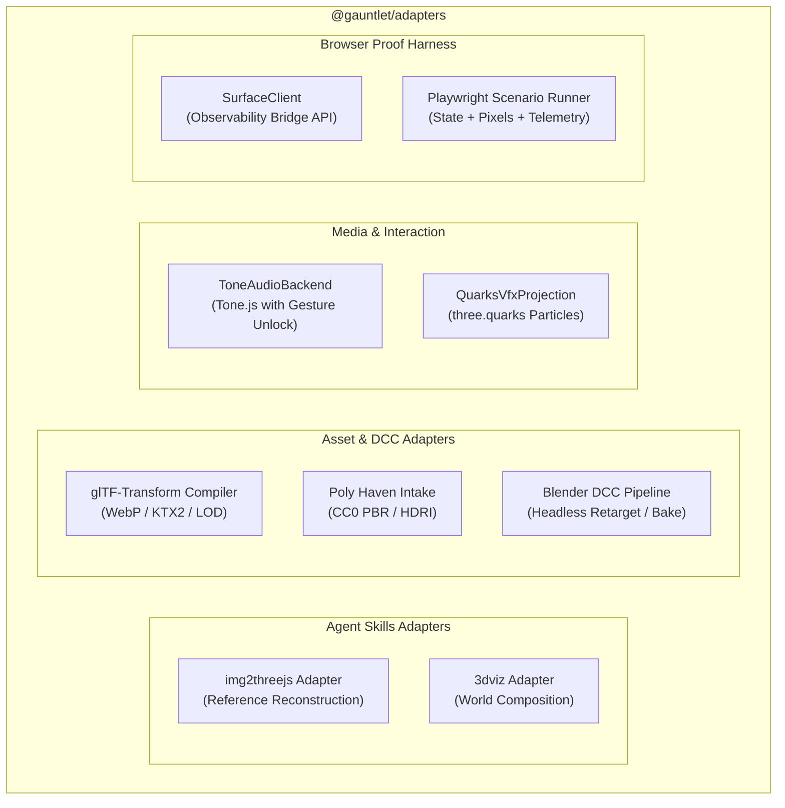

# Subsystem Guide: Production Adapters (`@gauntlet/adapters`)

The `@gauntlet/adapters` package encapsulates all concrete bridges to external tools, DCC software, asset compilers, audio frameworks, particle systems, and browser test harnesses. It normalizes third-party and agent-skill outputs into studio contracts.

---

## 1. Purpose & Responsibilities

### Purpose
To provide isolated, requirement-serving integrations with external tools without allowing external tool architectures, vendor nouns, or unearned abstractions to leak into the studio core or runtime engine.

### Responsibilities
- **Agent-Skill Handoffs**: Prepare handoff envelopes and deterministically verify outputs for `img2threejs` and `3dviz-pro-max`.
- **Asset Processing**: Optimize glTF/GLB models, prune unused materials, and compile textures to WebP and KTX2 via glTF-Transform.
- **Sourced Content Intake**: Ingest CC0 PBR textures and HDRI environments from Poly Haven.
- **DCC Escalation**: Execute headless Blender (`blender --background`) pipelines for complex rigging, animation retargeting, and baking.
- **Audio & VFX**: Provide browser audio implementations via Tone.js (`ToneAudioBackend`) with user-gesture unlocking, and particle projections via `three.quarks`.
- **Browser Proof Harness**: Drive Playwright to interact with the runtime's observability bridge, capture viewport pixels, sample renderer telemetry, and return structured `ChannelEvidence`.

### Non-Responsibilities
- Does not define domain schemas (owned by `@gauntlet/contracts`).
- Does not own gameplay state or simulation scheduling (owned by `@gauntlet/runtime`).

---

## 2. Subsystem Layout & Adapters

---

## 3. Core Modules & Mechanisms

### A. Reference-Image Reconstruction (`agent-skills/`)
Implements the `asset.reconstruct.reference-image` capability:
- **`prepareReferenceImageReconstruction(request)`**: Validates that reference image URIs exist and returns an `AgentHandoff` targeting `img2threejs`.
- **`verifyImg2ThreeJsResult(resultFile)`**: Deterministically validates that the generated procedural Three.js module compiles cleanly, attaches to the single standard Three.js dependency, exposes required semantic nodes (`power_switch`, `tuning_knob`), and satisfies triangle budgets.

### B. World Composition (`agent-skills/3dviz/`)
Implements the `world.environment.compose` capability:
- **`assertWorldCompositionIntentBoundary(intent)`**: Enforces that 3dviz does not attempt to generate terrain heightfields or build navmesh geometry.
- **`verifyWorldCompositionResultFile(file)`**: Validates kit placements, lighting specs, and vegetation scatter against canonical terrain boundaries.

### C. glTF-Transform Pipeline (`assets/gltf.ts`)
Optimizes production 3D assets:
- **`planGltfOptimization(options)`**: Analyzes raw GLB files and formulates optimization steps.
- **`runGltfPipeline(inputPath, outputPath, options)`**:
  - Re-compresses textures to WebP (default baseline) or KTX2 (requires `toktx` preflight).
  - Prunes unused attributes, welds vertices, and quantizes geometry.
  - Emits an `AssetBudgetSummary` with before/after byte sizes, triangle counts, and texture memory.

### D. Blender DCC Escalation (`dcc/`)
Used exclusively when procedural or glTF routes cannot satisfy the requirement:
- **Preflight Check**: `checkBlenderPreflight()` verifies that Blender 5.x LTS is installed on PATH.
- **Headless Pipeline**: `runServiceDroneRetargetPipeline()` executes `blender --background --factory-startup --python <script>` to retarget keyframe animations across non-identical armatures and bake them cleanly.
- **Committed Derivatives**: Accepted outputs commit as static GLBs into the repository; normal builds and tests consume these committed derivatives without requiring Blender.

### E. Procedural Audio Backend (`audio/tone-backend.ts`)
- **`ToneAudioBackend`**: Implements the `AudioBackend` interface using Tone.js.
- **User Gesture Unlock**: Browsers block audio playback until user interaction. `ToneAudioBackend` tracks state (`locked` -> `suspended` -> `ready`). Real browser tests prove unlock behavior via synthetic user clicks; headless tests run with `NullAudioBackend`.

### F. Playwright Proof Harness (`browser/`)
Drives deterministic verification in headless Chrome:
- **`SurfaceClient`**: Connects to `window.__GAUNTLET_STUDIO_OBS__` inside the page. Provides typed async access to `entities.get()`, `entities.snapshot()`, `renderer.stats()`, and `control.step()`.
- **`runScenario(scenario, options)`**: Executes a named scenario, waits for `SubsystemBarrier`, steps simulation ticks, captures screenshots, gathers telemetry, and returns structured `ChannelEvidence`.

---

## 4. Invariants & Failure Modes

### Core Invariants
1. **Single Three.js Dependency**: Adapters must never bundle an independent version of Three.js.
2. **Deterministic Offline Verification**: `verifyImg2ThreeJsResult` and `verifyBlenderProcessResult` must execute deterministically without making network requests or requiring API keys.
3. **Blender Independence for Normal Builds**: Normal builds, tests, and CI must pass when Blender is physically absent from PATH.

### Common Failure Modes
- **`BlenderPreflightError`**: Thrown if Blender escalation is requested when Blender is not installed.
- **`ToktxMissingError`**: Thrown if KTX2 compression is requested without `toktx` binary present. (Fall back to WebP baseline).
- **`ReferenceImageMissingError`**: Thrown if `asset.reconstruct` is invoked without a valid reference image URI.
- **`AudioLockedError`**: Thrown if audio is triggered in a browser before receiving a user interaction gesture.

---

## 5. Source Trail

- **Image Reconstruction**: [`packages/adapters/src/agent-skills/handoff.ts`](file:///home/sprime01/projects/gauntlet-game-studio/packages/adapters/src/agent-skills/handoff.ts), [`packages/adapters/src/agent-skills/verify-result.ts`](file:///home/sprime01/projects/gauntlet-game-studio/packages/adapters/src/agent-skills/verify-result.ts)
- **World Composition**: [`packages/adapters/src/agent-skills/3dviz.ts`](file:///home/sprime01/projects/gauntlet-game-studio/packages/adapters/src/agent-skills/3dviz.ts)
- **glTF Optimization**: [`packages/adapters/src/assets/gltf.ts`](file:///home/sprime01/projects/gauntlet-game-studio/packages/adapters/src/assets/gltf.ts)
- **Poly Haven Intake**: [`packages/adapters/src/assets/polyhaven.ts`](file:///home/sprime01/projects/gauntlet-game-studio/packages/adapters/src/assets/polyhaven.ts)
- **Blender Pipeline**: [`packages/adapters/src/dcc/pipeline.ts`](file:///home/sprime01/projects/gauntlet-game-studio/packages/adapters/src/dcc/pipeline.ts), [`packages/adapters/src/dcc/preflight.ts`](file:///home/sprime01/projects/gauntlet-game-studio/packages/adapters/src/dcc/preflight.ts)
- **Audio & VFX**: [`packages/adapters/src/audio/tone-backend.ts`](file:///home/sprime01/projects/gauntlet-game-studio/packages/adapters/src/audio/tone-backend.ts), [`packages/adapters/src/vfx/quarks/index.ts`](file:///home/sprime01/projects/gauntlet-game-studio/packages/adapters/src/vfx/quarks/index.ts)
- **Browser Harness**: [`packages/adapters/src/browser/surface-client.ts`](file:///home/sprime01/projects/gauntlet-game-studio/packages/adapters/src/browser/surface-client.ts), [`packages/adapters/src/browser/harness.ts`](file:///home/sprime01/projects/gauntlet-game-studio/packages/adapters/src/browser/harness.ts)
- **Tests**: [`packages/adapters/test/`](file:///home/sprime01/projects/gauntlet-game-studio/packages/adapters/test/)
