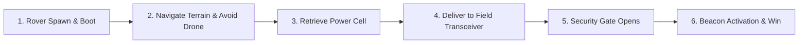
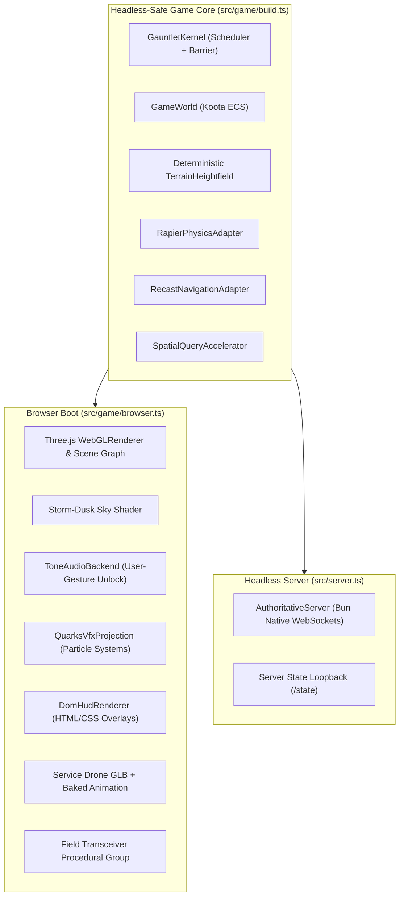

# Subsystem Guide: Blackwater Relay Reference Game (`examples/blackwater-relay`)

Blackwater Relay is the reference vertical slice game in Gauntlet Game Studio. It proves that the first-party runtime, capability-routed assets, single-player simulation, and authoritative multiplayer networking hold together in a playable, browser-native game increment settled by Gauntlet evidence.

---

## 1. Gameplay Concept & World Setting

In Blackwater Relay, the player operates a rugged exploration rover across a storm-dusk island terrain. The objective is to retrieve a power cell, navigate across rugged terrain while avoiding an autonomous service drone on patrol, deliver the cell to an interactive field transceiver, pass through an opened security gate, and activate an emergency broadcast beacon.

---

## 2. The 6 Frozen Named Scenarios

The reference game declares 6 frozen named scenarios (defined in `examples/blackwater-relay/.agents/specs/game.spec.yaml` and implemented in `src/game/build.ts`):

| Scenario ID | Initial Program & Conditions | Expected Consequence |
| :--- | :--- | :--- |
| **`boot`** | Rover idle at spawn; cell free on ground; gate closed; drone patrolling; beacon inactive. | Subsystems settle to `ready`; HUD displays initial prompt; rover stationary. |
| **`active-play`** | Rover accelerates forward across terrain corridor towards relay station. | Rover moves along navigation corridor; coordinates change; frame rate maintains 60fps. |
| **`transceiver-interaction`** | Rover carries power cell into transceiver interaction radius. | Cell state transitions to `delivered`; transceiver emits activation particles and audio trigger. |
| **`patrol-obstacle`** | Service drone patrols waypoint loop; dynamic obstacle introduced. | Drone Recast crowd agent navigates around obstacle without collision or path invalidation. |
| **`beacon-activation`** | Security gate opens; rover reaches final summit beacon. | Gate elevation shifts down; beacon illuminates with emissive glow (`beacon-lamp`); win message displayed. |
| **`performance-flythrough`** | Automated camera traverses entire island terrain from elevation. | Full scene rendered; verifies draw calls (`<= 45`), triangles (`<= 50,000`), and frame times (`<= 16.6ms`). |

---

## 3. Architecture: Browser vs. Headless Parity

Blackwater Relay is architected to prove **headless purity** without duplicating game logic:

### Headless Test Core (`src/game/headless.ts`, `src/game/build.ts`)
- Instantiates the complete simulation kernel, Koota ECS, Rapier WASM physics, Recast navigation, and spatial BVH.
- Does **not** import Three.js renderer, WebGL, DOM, or AudioContext.
- Executes in Bun child processes (`tests/scenarios-headless.run.ts`), advancing hundreds of simulation ticks in milliseconds.

### Browser Assembly (`src/game/browser.ts`)
- Bundled into `dist/game.js` via `scripts/bundle.ts` and loaded by `dist/index.html`.
- Attaches browser-only execution projections:
  - Three.js renderer, storm-dusk custom shader sky, and lighting.
  - Procedural rover, gate, cell, and beacon render meshes.
  - The accepted `img2threejs` field transceiver procedural module.
  - The committed Blender-derived service drone (`assets/service-drone.glb`) with baked hover animation.
  - Tone.js audio backend (unlocked via real user gesture).
  - Quarks particle effects for the beacon and transceiver.
  - DOM/CSS HUD for mission prompts.

---

## 4. Single-Player Purity vs. Authoritative Multiplayer

### Single-Player Zero-Network Guarantee
When booted in single-player mode, the game constructs zero network transports. The `network` subsystem is deliberately omitted from `SubsystemBarrier`. Single-player tests pass completely with network APIs intentionally sabotaged.

### Authoritative Multiplayer Server (`src/server.ts`)
When booted in multiplayer mode:
- `src/server.ts` boots the **exact same game core** (`bootGameCore`) on a headless server.
- Binds `AuthoritativeServer` over `BunWebSocketServerTransport`.
- Clients (`src/net/client.ts`) send sequenced, validated command envelopes.
- Server applies commands to Koota, steps `stepGame()`, filters entities by relevance radius (`RadiusInterestFilter`), and broadcasts delta snapshots.
- Single-player logic is completely unchanged.

---

## 5. Provenance & Accepted Production Assets

1. **Field Transceiver (`assets/field-transceiver.ts`)**:
   - Reconstructed via `asset.reconstruct.reference-image` (`img2threejs`) from `references/field-transceiver/reference.png`.
   - Committed as procedural Three.js code exposing semantic sockets (`socket_switch`, `socket_cell`).
2. **Service Drone (`assets/service-drone.glb`)**:
   - Escalated to Blender DCC (`dcc.blender.process`) for cross-rig keyframe retargeting and hover cycle baking.
   - Derivative accepted through glTF-Transform normalization into `AssetRegistry`.
   - Normal builds and tests consume the committed GLB derivative without requiring Blender on PATH.

---

## 6. Verification & Teeth Checks

The reference game includes adversarial "teeth" checks verifying that false successes are caught:
- **`teeth:network-disabled`**: Sabotages all network APIs and proves all 6 single-player scenarios still pass cleanly.
- **`teeth:blender-absent`**: Strips Blender from PATH and proves the game builds, bundles, and tests successfully using committed derivatives.
- **`teeth:corrupt-transition`**: Injects a desynchronization between visual gate animation and Koota gate state, proving that Gauntlet catches the `pixels_pass_state_fail` contradiction and rejects the increment.
- **`teeth:multiplayer`**: Runs a hostile client attack battery (malformed packets, out-of-sequence ticks, forged entity IDs) proving the authoritative server rejects invalid mutations.

---

## 7. Source Trail

- **Browser Entry & Boot**: [`examples/blackwater-relay/src/main.ts`](file:///home/sprime01/projects/gauntlet-game-studio/examples/blackwater-relay/src/main.ts), [`examples/blackwater-relay/src/game/browser.ts`](file:///home/sprime01/projects/gauntlet-game-studio/examples/blackwater-relay/src/game/browser.ts)
- **Game Core & Scenarios**: [`examples/blackwater-relay/src/game/build.ts`](file:///home/sprime01/projects/gauntlet-game-studio/examples/blackwater-relay/src/game/build.ts), [`examples/blackwater-relay/src/game/headless.ts`](file:///home/sprime01/projects/gauntlet-game-studio/examples/blackwater-relay/src/game/headless.ts)
- **Authoritative Server**: [`examples/blackwater-relay/src/server.ts`](file:///home/sprime01/projects/gauntlet-game-studio/examples/blackwater-relay/src/server.ts)
- **Game Systems & State**: [`examples/blackwater-relay/src/game/systems.ts`](file:///home/sprime01/projects/gauntlet-game-studio/examples/blackwater-relay/src/game/systems.ts), [`examples/blackwater-relay/src/game/state.ts`](file:///home/sprime01/projects/gauntlet-game-studio/examples/blackwater-relay/src/game/state.ts)
- **Assets**: [`examples/blackwater-relay/src/assets/field-transceiver.ts`](file:///home/sprime01/projects/gauntlet-game-studio/examples/blackwater-relay/src/assets/field-transceiver.ts), [`examples/blackwater-relay/src/assets/service-drone.ts`](file:///home/sprime01/projects/gauntlet-game-studio/examples/blackwater-relay/src/assets/service-drone.ts)
- **Tests**: [`examples/blackwater-relay/tests/`](file:///home/sprime01/projects/gauntlet-game-studio/examples/blackwater-relay/tests/)
