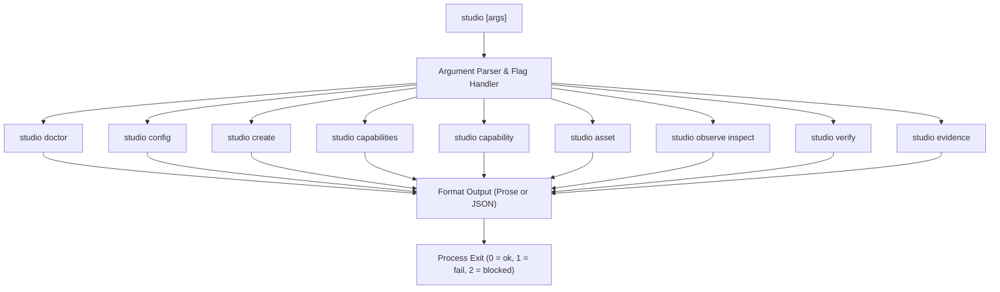

# Subsystem Guide: Studio CLI & Operator Interface (`@gauntlet/studio-cli`)

The `apps/studio-cli` application provides the machine-readable command-line interface (`studio`) for Gauntlet Game Studio. It serves both coding agents and human engineers by exposing structured commands for preflight diagnostics, project creation, capability routing, asset management, and Gauntlet settlement.

---

## 1. Purpose & Responsibilities

### Purpose
To provide an unambiguous, deterministic command interface with structured JSON outputs and stable exit semantics, enabling agents to automate development without scraping terminal prose.

### Responsibilities
- **Semantic Automation**: Expose domain commands (`doctor`, `create`, `capabilities`, `capability`, `asset`, `observe`, `verify`, `evidence`).
- **Machine-Readable Protocol**: Output standard JSON when `--json` is supplied, conforming to `StudioResultSchema`.
- **Exit Code Discipline**: Enforce strict exit semantics:
  - `0`: Success (settled, clean diagnostic, completed).
  - `1`: Failure / Error (unhandled exception, assertion failure).
  - `2`: Blocked (external prerequisite missing, such as offline browser proof or missing revision).
- **Secret Hygiene**: Parse configuration and environment variables without echoing raw credentials or tokens to stdout/stderr.
- **Operator Facade**: Back the root `justfile` recipes with semantic CLI invocations.

### Non-Responsibilities
- Does not implement business logic directly; it parses CLI flags and delegates to `@gauntlet/studio`, `@gauntlet/contracts`, and `@gauntlet/adapters`.

---

## 2. Command Vocabulary & Architecture

---

## 3. Core Commands & Flags

### `studio doctor`
Performs comprehensive preflight diagnostics on environment and repository health:
- Checks Bun version baseline (`>= 1.4.0`).
- Verifies `.tmp/` donor isolation in `.gitignore`.
- Audits root `package.json` for forbidden donor dependencies.
- Validates configuration integrity and secret hygiene.
- Confirms presence of all 5 approved workspace packages.
- Supports `--json` for machine intake.

### `studio create <target-path>`
Scaffolds an independent game project using `templates/game/`:
- Options: `--name <project-name>`, `--template <dir>`, `--json`.
- Copies template files, resolves studio lock dependencies, and verifies that the created game builds cleanly outside the monorepo.

### `studio capabilities` & `studio capability`
Inspects and executes capability routing:
- `studio capabilities`: Lists all registered capabilities with summaries and providers.
- `studio capabilities lint`: Runs `lintStudioSkillSurface()` to enforce description lengths (200–400 chars) and negative affordance declarations.
- `studio capability route --intent "<intent>" [--ref <id>]`: Routes an intent string to a matching capability descriptor.
- `studio capability prepare <capability-id> --request <file>`: Emits an `AgentHandoff` envelope for an agent skill.
- `studio capability verify-result <capability-id> --result <file>`: Deterministically verifies an agent skill's emitted output.

### `studio asset`
Controls production asset intake and compilation:
- `studio asset register --id <id> --role <role> --origin <origin> --source <path>`: Ingests an asset into `assets/manifest.json`.
- `studio asset verify [--all]`: Runs asset acceptance gates (provenance, licensing, budgets).
- `studio asset compile --input <in.glb> --output <out.glb> [--webp | --ktx2]`: Runs glTF-Transform optimization.

### `studio observe inspect`
Audits a running development or test game instance:
- Connects to `window.__GAUNTLET_STUDIO_OBS__`.
- Dumps readiness state, entity registry snapshots, camera pose, and renderer stats.

### `studio verify`
The primary Gauntlet settlement command:
- `studio verify --scenario <name> --profile <profile> [--suite <suite>] [--json]`:
  - Drives Playwright headless Chrome to execute the scenario.
  - Samples tri-channel evidence (state, pixels, telemetry).
  - Evaluates against `FrozenExpectation`.
  - Emits `SettlementRecord`.
  - Exits with `0` (settled), `1` (failed), or `2` (blocked).

### `studio evidence`
Inspects the immutable evidence store:
- `studio evidence list`: Displays stored observation runs.
- `studio evidence check-fixtures`: Verifies deterministic proof fixtures against frozen expectations.

---

## 4. Relationship to `justfile`

The root `justfile` provides an ergonomic operator facade over the semantic CLI and mechanical Python verification scripts:

| Just Target | Underlying Command | Purpose |
| :--- | :--- | :--- |
| `just doctor` | `bun run studio -- doctor` | Environment health preflight |
| `just check` | `just validate-agent-artifacts && bun x tsc --noEmit` | Structural verification & typechecking |
| `just test` | `just validate-agent-artifacts && bun test` | Test suite execution across monorepo |
| `just lint` | `just validate-agent-artifacts && python3 py_compile scripts/...` | Python & repository topology hygiene |
| `just validate-agent-artifacts` | `python3 scripts/check-traceability.py && python3 scripts/check-topology.py` | Spec/plan traceability & monorepo topology |
| `just ci` | Composite alias: `check` + `test` + `lint` + `doctor` | Global CI gate |

---

## 5. Invariants & Failure Modes

### Core Invariants
1. **Machine-Readable Guarantee**: When `--json` is specified, the CLI must output valid JSON as its final stdout message conforming to `StudioResult`.
2. **Stable Exit Codes**: A blocked run (e.g. Playwright missing in an environment without Chrome) must exit with code `2`, never `0` (which implies success) or `1` (which implies a code defect).
3. **Secret Hygiene**: Ingested tokens and credentials are masked (`***`) in all stdout/stderr messages.

### Common Failure Modes
- **Exit Code 2 (Blocked)**: Occurs during `studio verify` if headless Chrome cannot launch or if project git revision cannot be resolved.
- **Exit Code 1 (Failed)**: Occurs if an expectation check fails or an assertion fails.

---

## 6. Source Trail

- **CLI Main**: [`apps/studio-cli/src/index.ts`](file:///home/sprime01/projects/gauntlet-game-studio/apps/studio-cli/src/index.ts)
- **Justfile**: [`justfile`](file:///home/sprime01/projects/gauntlet-game-studio/justfile)
- **CLI Automated Tests**: [`apps/studio-cli/src/cli.test.ts`](file:///home/sprime01/projects/gauntlet-game-studio/apps/studio-cli/src/cli.test.ts)
- **Doctor Diagnostic**: [`packages/studio/src/doctor.ts`](file:///home/sprime01/projects/gauntlet-game-studio/packages/studio/src/doctor.ts)
