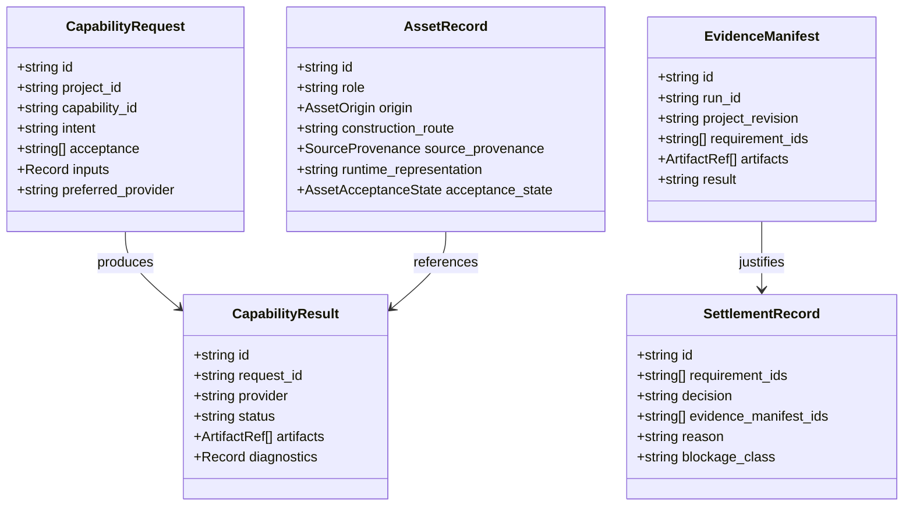

# Subsystem Guide: Contracts (`@gauntlet/contracts`)

The `@gauntlet/contracts` package serves as the provider-neutral, immutable lingua franca for Gauntlet Game Studio. It defines the core data schemas, wire protocols, manifest formats, and validation rules that bind all other packages together.

---

## 1. Purpose & Responsibilities

### Purpose
To establish stable, typed, executable boundaries between game requirements, studio orchestration, first-party runtime execution, external specialist tools, and verification evidence.

### Responsibilities
- Define and export Zod schemas (`.strict()`) for all inter-subsystem data structures.
- Infer and export authoritative TypeScript interfaces from those schemas.
- Provide zero-dependency runtime validators (`validateCapabilityRequest`, `validateCapabilityResult`, `validateAssetRecord`, `validateEvidenceManifest`).
- Forbid vendor-specific nouns (e.g., `mavonGameObject`, `needleComponent`) from entering domain contracts.

### Non-Responsibilities
- Does not contain engine runtime logic (owned by `@gauntlet/runtime`).
- Does not contain file I/O or filesystem persistence (owned by `@gauntlet/studio`).
- Does not perform network transport (owned by `@gauntlet/runtime/src/network`).

---

## 2. Core Schemas & Types

### Key Contract Definitions

#### `CapabilityDescriptorSchema`
Defines a stable studio affordance independently of current tools:
- `id`: Lowercase dotted namespace (regex: `^[a-z0-9]+(\.[a-z0-9_-]+)+$`).
- `summary`: Human and agent-readable summary (10 to 1024 characters).
- `use_when`: Array of positive triggers indicating when this capability applies.
- `do_not_use_when`: Array of explicit negative affordances guarding against false matches.
- `inputs` / `outputs`: Required data parameters.
- `verification`: Declared verification methods required after execution.
- `providers`: List of approved provider adapters.

#### `CapabilityRequestSchema` & `CapabilityResultSchema`
- **Request**: Admitted work prior to provider selection. Enforces `.strict()` validation to ensure no provider-specific metadata is leaked.
- **Result**: Normalizes provider execution outcomes (`success`, `blocked`, `failed`, `degraded`), capturing emitted artifacts, diagnostics, and degradation rationales.

#### `AssetRecordSchema`
Tracks production lifecycle and legal provenance of game assets:
- `origin`: Strict enum (`user`, `project`, `cc0`, `licensed`, `generated`, `blender`, `procedural`).
- `acceptance_state`: Strict enum (`pending`, `accepted`, `rejected`, `blocked`, `degraded`).
- `source_provenance`: Captures `uri`, `license`, `author`, `sha256`, and `retrieved_at`.

#### `RuntimeReadinessSchema`
Synchronizes asynchronous subsystem startup:
- `state`: Overall runtime state (`created`, `booting`, `ready`, `failed`).
- `required_subsystems`: List of critical subsystem IDs (e.g. `physics`, `navigation`).
- `subsystem_states`: Map of subsystem ID to state (`uninitialized`, `booting`, `ready`, `failed`).
- Refinement rule: Overall state cannot be `ready` unless every required subsystem in `subsystem_states` is `ready`.

#### `EvidenceManifestSchema` & `SettlementRecordSchema`
- **Manifest**: Binds concrete artifacts (`screenshots`, `state_dumps`, `telemetry_logs`) to a specific `ObservationRun` and `project_revision`. Requires non-empty artifacts and at least one cited requirement ID.
- **Settlement**: The formal outcome record (`settled`, `blocked`, `failed`, `incomplete`) recording evidence manifests cited, blockage classifications, and confirmation modes.

---

## 3. Invariants & Failure Modes

### Invariants Protected
1. **Zero External Dependencies**: `@gauntlet/contracts` depends exclusively on `zod`. It has no dependencies on Three.js, Rapier, or Node/Bun primitives.
2. **Schema Strictness**: All schemas use `.strict()`. Any unexpected properties injected into requests or manifests cause immediate parse validation errors.
3. **Immutability of Proof**: `EvidenceManifest` and `SettlementRecord` must declare the `project_revision` they evaluate; historical substitution is blocked.

### Common Failure Modes
- **`ZodError: Unrecognized key`**: Occurs when a caller attempts to pass provider-specific flags or internal states directly into a `CapabilityRequest`. Fix by nesting arguments in `inputs` or normalizing provider metadata.
- **`Runtime state cannot be 'ready'`**: Occurs when a developer attempts to serialize a readiness snapshot where `state: "ready"` while one of the required subsystems is still `booting` or `failed`.

---

## 4. Source Trail

- **Schemas**: [`packages/contracts/src/schemas.ts`](file:///home/sprime01/projects/gauntlet-game-studio/packages/contracts/src/schemas.ts)
- **TypeScript Types**: [`packages/contracts/src/types.ts`](file:///home/sprime01/projects/gauntlet-game-studio/packages/contracts/src/types.ts)
- **Validators & Index**: [`packages/contracts/src/index.ts`](file:///home/sprime01/projects/gauntlet-game-studio/packages/contracts/src/index.ts)
- **Contract Tests**: [`packages/contracts/src/schemas.test.ts`](file:///home/sprime01/projects/gauntlet-game-studio/packages/contracts/src/schemas.test.ts), [`packages/contracts/src/index.test.ts`](file:///home/sprime01/projects/gauntlet-game-studio/packages/contracts/src/index.test.ts)
