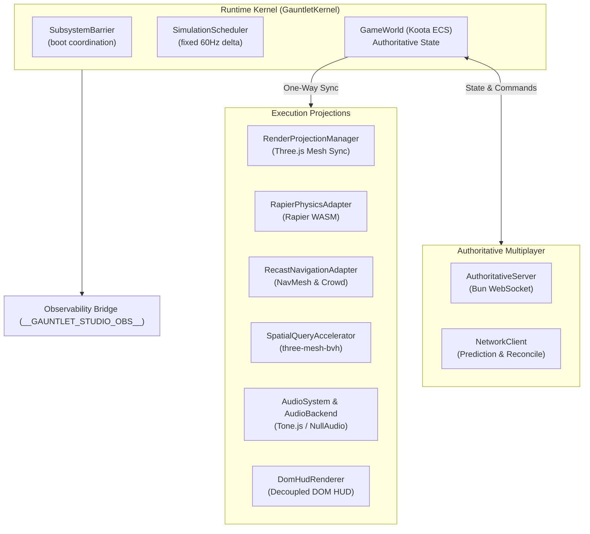

# Subsystem Guide: Gauntlet Runtime (`@gauntlet/runtime`)

The `@gauntlet/runtime` package is the first-party game engine powering all browser and headless simulation in Gauntlet Game Studio. It integrates Koota ECS for semantic authority, standard Three.js for visual rendering, Rapier 3D for physics, Recast for navigation, three-mesh-bvh for spatial acceleration, Bun WebSockets for authoritative networking, Tone.js for audio, and the versioned observability bridge.

---

## 1. Purpose & Responsibilities

### Purpose
To execute games deterministically in both browser and pure headless environments, ensuring that game logic is strictly isolated from visual, physics, and DCC representations.

### Responsibilities
- **Semantic State Authority**: Host entities, traits, and game logic inside Koota ECS (`GameWorld`).
- **Deterministic Scheduling**: Advance simulation state via fixed-timestep sub-steps (`SimulationScheduler`) with single-step ownership.
- **Asynchronous Synchronization**: Coordinate subsystem boot lifecycle via `SubsystemBarrier`.
- **One-Way Projections**: Synchronize transforms, velocities, and tags to Three.js meshes, Rapier colliders, Recast agents, and DOM UI.
- **Observability**: Expose the versioned `window.__GAUNTLET_STUDIO_OBS__` (v1) bridge with production mutation lockout.
- **Headless Purity**: Guarantee the core simulation runs without DOM, WebGL, or AudioContext.

### Non-Responsibilities
- Does not generate 3D assets or scenes (owned by `@gauntlet/adapters`).
- Does not route capabilities or perform settlement decisions (owned by `@gauntlet/studio`).

---

## 2. Architecture & Subsystem Layout



---

## 3. Core Modules & Mechanisms

### A. Subsystem Readiness Barrier (`readiness.ts`)
Asynchronous modules register with `SubsystemBarrier`:
```typescript
const barrier = new SubsystemBarrier();
barrier.register("physics");
barrier.register("navigation");

// When Rapier WASM finishes loading:
barrier.markReady("physics");

// When Recast finishes building:
barrier.markReady("navigation");

await barrier.whenReady(); // Resolves with RuntimeReadiness
```
If any required subsystem fails, `whenReady()` rejects with `SubsystemBootError`. Simulation ticks are blocked while `isReady()` is false.

### B. Simulation Scheduler (`scheduler.ts`)
Controls the authoritative simulation clock:
- Accumulates delta time and steps fixed sub-steps (default: 60Hz / 16.66ms).
- Enforces the **Single Scheduler Invariant**: Instantiating a second active scheduler throws `MultipleSchedulerError`.
- Enforces the **Single Step Owner Invariant**: `executeStepOwner(ownerName, fn)` guarantees that only one registered gameplay system advances state per tick. Calling it twice in one tick throws `DuplicateStepOwnerError`.

### C. GameWorld & Semantic Traits (`state/`)
Authoritative entities live in Koota ECS:
- **Traits**: `EntityId`, `Transform`, `Velocity`, `RenderProjectionHandle`, `PhysicsProjectionHandle`, `NavigationProjectionHandle`, `AssetBinding`, and semantic tags (`PlayerTag`, `EnemyTag`, `ObstacleTag`, `VehicleTag`, `ItemTag`).
- **Snapshots**: `takeSemanticSnapshot()` serializes complete entity states to plain JSON-safe structures for replication and test verification.
- **Provider Lockout**: `assertValidSemanticData()` uses reflection to scan trait objects. If an `Object3D`, `RigidBody`, `HTMLElement`, or Mavon donor class is found, it throws immediately.

### D. Canonical Terrain Heightfields (`terrain/`)
Terrain elevation is calculated deterministically via multi-octave mathematical formulas in `generateProceduralHeightfield()`.
- Generates a canonical `TerrainHeightfield` (grid of raw floats, dimensions, and seed).
- Projections derive *downstream* from the canonical heightfield:
  - `createTerrainRenderProjection()` produces the Three.js visual mesh.
  - `createTerrainNavigationGeometry()` produces the Recast collision triangles.
  - `RapierPhysicsAdapter` creates the heightfield collider.
- Guarantees strict elevation parity across rendering, physics, and navigation.

### E. Physics & Navigation Adapters (`physics/`, `navigation/`)
- **`RapierPhysicsAdapter`**: Wraps `@dimforge/rapier3d-compat` (WASM). Advances Rapier physics exactly once per simulation tick.
- **`RecastNavigationAdapter`**: Wraps `recast-navigation` (WASM). Builds navmesh from terrain geometry, manages crowd agents, and computes path corridors.
- **`SpatialQueryAccelerator`**: Wraps `three-mesh-bvh` to accelerate raycasts and line-of-sight checks.

### F. Observability Bridge (`observability/`)
Mounts `window.__GAUNTLET_STUDIO_OBS__` (v1):
- **Read APIs**: `readiness()`, `entities.get(id)`, `entities.query(tag)`, `renderer.stats()`, `physics.dump()`, `navigation.status()`, `camera.active()`.
- **Control APIs** (development/test builds only): `pause()`, `resume()`, `step(n)`, `setSeed(s)`, `resetScenario(name)`, `selectView(name)`.
- **Production Lockout**: In production builds (`mode: "production"`), the `control` namespace is never created. `inspectProductionSurface()` audits the mounted object and throws if any mutation methods are detected.

---

## 4. Invariants & Failure Modes

### Core Invariants
1. **Headless Purity**: Importing `@gauntlet/runtime` must never touch `document`, `window`, or WebGL contexts.
2. **Koota Exclusivity**: No subsystem other than `GameWorld` owns authoritative gameplay truth.
3. **No Direct Three.js Mutation**: Mutating a Three.js `position` does not move the game entity. Transforms must update through Koota.

### Common Failure Modes
- **`HeadlessDomLeakError`**: Thrown if browser/DOM globals are accessed during headless execution.
- **`MultipleSchedulerError`**: Thrown if multiple `SimulationScheduler` instances exist simultaneously.
- **`RuntimeNotReadyError`**: Thrown if gameplay logic attempts to step before all required subsystems settle in `SubsystemBarrier`.
- **`Forbidden provider object leaked`**: Thrown if an engineer accidentally stores a `THREE.Mesh` or `Rapier.RigidBody` inside a Koota trait.

---

## 5. Source Trail

- **Kernel**: [`packages/runtime/src/kernel.ts`](file:///home/sprime01/projects/gauntlet-game-studio/packages/runtime/src/kernel.ts)
- **Scheduler**: [`packages/runtime/src/scheduler.ts`](file:///home/sprime01/projects/gauntlet-game-studio/packages/runtime/src/scheduler.ts)
- **Readiness**: [`packages/runtime/src/readiness.ts`](file:///home/sprime01/projects/gauntlet-game-studio/packages/runtime/src/readiness.ts)
- **GameWorld & Traits**: [`packages/runtime/src/state/world.ts`](file:///home/sprime01/projects/gauntlet-game-studio/packages/runtime/src/state/world.ts), [`packages/runtime/src/state/traits.ts`](file:///home/sprime01/projects/gauntlet-game-studio/packages/runtime/src/state/traits.ts)
- **Physics**: [`packages/runtime/src/physics/rapier.ts`](file:///home/sprime01/projects/gauntlet-game-studio/packages/runtime/src/physics/rapier.ts)
- **Navigation**: [`packages/runtime/src/navigation/recast.ts`](file:///home/sprime01/projects/gauntlet-game-studio/packages/runtime/src/navigation/recast.ts)
- **Terrain**: [`packages/runtime/src/terrain/heightfield.ts`](file:///home/sprime01/projects/gauntlet-game-studio/packages/runtime/src/terrain/heightfield.ts)
- **Observability**: [`packages/runtime/src/observability/bridge.ts`](file:///home/sprime01/projects/gauntlet-game-studio/packages/runtime/src/observability/bridge.ts), [`packages/runtime/src/observability/production-check.ts`](file:///home/sprime01/projects/gauntlet-game-studio/packages/runtime/src/observability/production-check.ts)
- **Tests**: [`packages/runtime/test/`](file:///home/sprime01/projects/gauntlet-game-studio/packages/runtime/test/)
