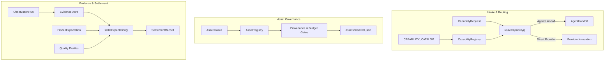

# Subsystem Guide: Studio Core (`@gauntlet/studio`)

The `@gauntlet/studio` package contains the orchestration, routing, asset governance, evidence collection, and settlement engine of Gauntlet Game Studio. It manages developer intent, coordinates specialist capabilities, and evaluates proof.

---

## 1. Purpose & Responsibilities

### Purpose
To act as the coordinating brain for agentic game development, ensuring that user and agent requirements are routed to stable capabilities, assets follow strict provenance and budget rules, and all development claims are adjudicated against frozen expectations.

### Responsibilities
- **Capability Registry & Catalog**: Maintain the catalog of studio affordances with positive triggers and negative boundaries.
- **Capability-First Router**: Disambiguate intent and route work to approved provider adapters before loading provider detail.
- **Skill Overlay Governance**: Prevent upstream director agents from competing with studio orchestration and quarantine generic generators.
- **Asset Registry**: Track production assets, enforce provenance gates, manage WebP/KTX2 compilation, and record append-only history.
- **Evidence Store**: Manage run-scoped, immutable storage for observation runs, screenshots, and telemetry.
- **Gauntlet Settlement Engine**: Evaluate frozen expectations against tri-channel evidence and emit formal `SettlementRecord` artifacts.
- **Game Project Generator**: Scaffold independent, decoupled game projects via `createGameProject()`.

### Non-Responsibilities
- Does not contain engine simulation or rendering code (owned by `@gauntlet/runtime`).
- Does not perform low-level tool execution like headless Blender or Playwright runs (owned by `@gauntlet/adapters`).

---

## 2. Architecture & Subsystem Layout



---

## 3. Core Modules & Mechanisms

### A. Capability Catalog & Router (`capabilities/`, `router/`)
- **`CAPABILITY_CATALOG`**: An array of `CapabilityDescriptor` objects (`world.composition`, `asset.reconstruct`, `world.terrain`, `world.physics`, `world.navigation`, `world.spatial`, `asset.source`, `asset.optimize`, `dcc.blender.process`, `vfx.particles`, `audio.procedural`, `network.multiplayer`, `verify.browser`).
- **Negative Boundary Routing**: When an agent asks to "reconstruct a radio transmitter", the router checks `asset.reconstruct`. It verifies positive matches ("reconstructing a depicted object") and ensures negative affordances ("scene composition", "generic text-to-3D") are not violated.
- **Disambiguation**: The router prevents common agent failure modes, such as using `world.composition` (3dviz) to generate a single hero prop, or using `asset.reconstruct` (img2threejs) to compose an entire level.

### B. Skill Overlay Policy (`skills/`)
The studio integrates specialist knowledge from `threejs-game-skills` while enforcing strict governance:
- **Director Exclusion**: Upstream `threejs-game-director` is explicitly forbidden (`FORBIDDEN_UPSTREAM_AUTHORITY`). The studio owns all orchestration.
- **Generator Quarantine**: Generic generators (`threejs-3d-generator`, `threejs-image-generator`, `threejs-audio-generator`) are quarantined behind explicit enablement flags and cannot be selected if a reference image or CC0 asset exists.
- **Linter Gate**: `lintStudioSkillSurface()` verifies that all exposed skills have descriptions between 200–400 characters, contain positive triggers, and declare negative affordances.

### C. Asset Registry (`assets/`)
Production assets are stored with complete provenance in `AssetRegistry`:
```typescript
const registry = new AssetRegistry("./assets/manifest.json");

// Ingest an asset with provenance
const intake = registry.intake({
  id: "prop.field-transceiver",
  role: "interactive_hero_prop",
  origin: "user",
  construction_route: "asset.reconstruct.reference-image",
  source_provenance: { uri: "references/radio.png", license: "project-approved" },
  runtime_representation: "procedural_three",
  budget: { max_triangles: 2500 }
});

// Evaluate acceptance gates (licensing, budgets, colliders)
const outcome = registry.evaluate("prop.field-transceiver");
```
- **Append-Only Event Log**: Rejections, supersessions, and waivers are appended to `history`, preserving developmental truth.

### D. Evidence Store (`evidence/`)
- **Run-Scoped Isolation**: Evidence is stored in immutable directories: `artifacts/runs/<run_id>/`.
- **Revision Tracking**: `resolveProjectRevision()` calculates an immutable SHA-256 digest of project state. Manifests referencing a stale revision are rejected.

### E. Gauntlet Settlement Engine (`gauntlet/`)
`settleExpectation(input)` compares observed channel evidence against a `FrozenExpectation`:
- **State Evaluation**: Evaluates entity traits, tags, and transforms against declared assertions.
- **Pixel Evaluation**: Checks viewport captures against visual criteria (e.g. luminance thresholds, visual diffs).
- **Telemetry Evaluation**: Gated against `ResolvedQualityProfile` (triangles, draw calls, frame times).
- **Contradiction Detection**: If pixels pass but state fails, emits `pixels_pass_state_fail` and marks decision as `failed`.

### F. Game Project Generator (`generator.ts`)
`createGameProject(targetPath, options)` instantiates `templates/game/` into an independent project directory:
- Writes independent `package.json`, `studio.lock.yaml`, `AGENTS.md`, and directory layout.
- Ensures the created game builds and tests completely outside the studio monorepo.

---

## 4. Invariants & Failure Modes

### Core Invariants
1. **No Vendor Nouns in Domain Requests**: `CapabilityRequest` cannot contain provider names.
2. **Deterministic Settlement**: `settleExpectation()` is a pure function of frozen expectation and observed evidence. It does not perform network fetches or mutate code.
3. **Immutability of Evidence**: Once written to `EvidenceStore`, observation runs and manifests cannot be modified.

### Common Failure Modes
- **`RoutingError`**: Thrown if request intent matches no capability or triggers a negative boundary.
- **`PrematureSettlementError`**: Thrown if an agent attempts to settle an `AgentHandoff` before verifying outputs.
- **`RevisionUnavailableError`**: Thrown if evidence is collected without an identifiable project git revision.
- **`QualityProfileError`**: Thrown if performance evidence fails target hardware budgets.

---

## 5. Source Trail

- **Catalog & Registry**: [`packages/studio/src/capabilities/catalog.ts`](file:///home/sprime01/projects/gauntlet-game-studio/packages/studio/src/capabilities/catalog.ts), [`packages/studio/src/capabilities/registry.ts`](file:///home/sprime01/projects/gauntlet-game-studio/packages/studio/src/capabilities/registry.ts)
- **Router**: [`packages/studio/src/router/router.ts`](file:///home/sprime01/projects/gauntlet-game-studio/packages/studio/src/router/router.ts)
- **Skill Overlay**: [`packages/studio/src/skills/overlay.ts`](file:///home/sprime01/projects/gauntlet-game-studio/packages/studio/src/skills/overlay.ts), [`packages/studio/src/skills/linter.ts`](file:///home/sprime01/projects/gauntlet-game-studio/packages/studio/src/skills/linter.ts)
- **Asset Registry**: [`packages/studio/src/assets/registry.ts`](file:///home/sprime01/projects/gauntlet-game-studio/packages/studio/src/assets/registry.ts), [`packages/studio/src/assets/gates.ts`](file:///home/sprime01/projects/gauntlet-game-studio/packages/studio/src/assets/gates.ts)
- **Evidence Store**: [`packages/studio/src/evidence/store.ts`](file:///home/sprime01/projects/gauntlet-game-studio/packages/studio/src/evidence/store.ts), [`packages/studio/src/evidence/revision.ts`](file:///home/sprime01/projects/gauntlet-game-studio/packages/studio/src/evidence/revision.ts)
- **Settlement**: [`packages/studio/src/gauntlet/settle.ts`](file:///home/sprime01/projects/gauntlet-game-studio/packages/studio/src/gauntlet/settle.ts), [`packages/studio/src/gauntlet/expectation.ts`](file:///home/sprime01/projects/gauntlet-game-studio/packages/studio/src/gauntlet/expectation.ts)
- **Quality Profiles**: [`packages/studio/src/quality/profiles.ts`](file:///home/sprime01/projects/gauntlet-game-studio/packages/studio/src/quality/profiles.ts), [`packages/studio/src/quality/evaluate.ts`](file:///home/sprime01/projects/gauntlet-game-studio/packages/studio/src/quality/evaluate.ts)
- **Generator**: [`packages/studio/src/generator.ts`](file:///home/sprime01/projects/gauntlet-game-studio/packages/studio/src/generator.ts)
- **Tests**: [`packages/studio/test/`](file:///home/sprime01/projects/gauntlet-game-studio/packages/studio/test/)
