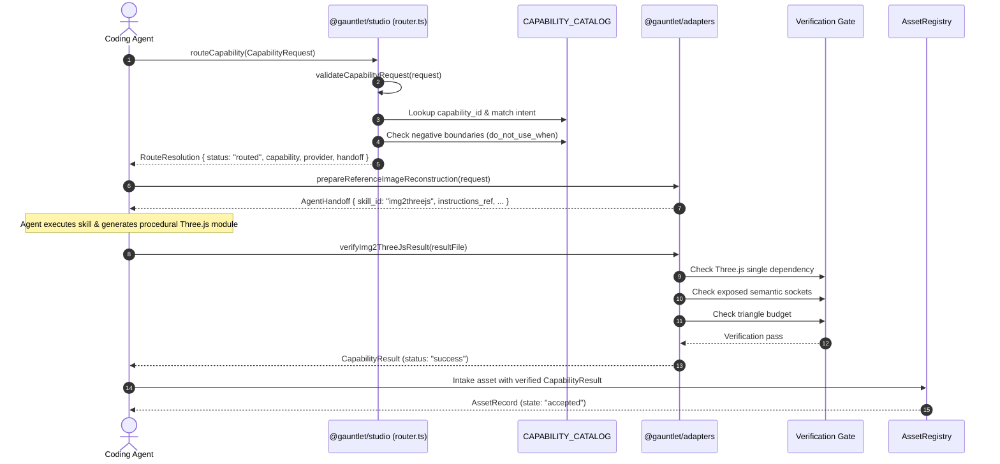

# Execution Trace: Capability Routing & Provider Handoff

This trace documents how developer intent is validated, routed to a stable capability contract, dispatched as an `AgentHandoff` or provider execution, and deterministically verified before acceptance.

---

## 1. Summary

When a game requirement (such as creating an asset or generating a level layout) is admitted to the studio, the system routes the request by **stable capability first**, checking positive triggers and negative boundaries. If the capability requires agent skills (e.g., `img2threejs`, `3dviz-pro-max`), an `AgentHandoff` envelope is prepared. Once the agent produces code, the result is deterministically verified offline before being admitted to `AssetRegistry`.

---

## 2. Sequence Diagram



---

## 3. Detailed Execution Steps

### Step 1: Ingestion & Validation
The caller constructs a `CapabilityRequest` containing `project_id`, `capability_id`, `intent`, and `acceptance` criteria. [`routeCapability()`](file:///home/sprime01/projects/gauntlet-game-studio/packages/studio/src/router/router.ts#L42) runs `validateCapabilityRequest(request)`. If unauthorized fields (like provider-specific parameters) are present, Zod rejects the request immediately.

### Step 2: Capability Resolution & Negative Boundary Checks
1. If `capability_id` is explicitly declared, it is resolved from [`CapabilityRegistry`](file:///home/sprime01/projects/gauntlet-game-studio/packages/studio/src/capabilities/registry.ts).
2. If implicit, intent strings are evaluated against `use_when` triggers.
3. **Negative Boundary Check**: The router tests the intent against `do_not_use_when`. For example, if a request intent mentions "reconstructing an object", the router ensures `world.composition` is rejected because its negative affordances explicitly state `do_not_use_when: ["reconstructing a single depicted object..."]`.
4. If a candidate violates negative boundaries, a `RoutingError` is thrown.

### Step 3: Provider Selection & Agent Handoff
Once the capability is identified:
- The preferred provider is selected from `candidate.providers`.
- If the provider is an agent skill (e.g. `agent-skill.img2threejs`), the adapter generates an `AgentHandoff`:
  ```typescript
  {
    request_id: "req-123",
    skill_id: "agent-skill.img2threejs",
    instructions_ref: "skills/img2threejs/SKILL.md",
    expected_outputs: ["dist/assets/transceiver.ts"],
    acceptance: ["exposes socket_switch and socket_cell", "triangles <= 2500"]
  }
  ```
- Premature settlement protection: attempting to settle a handoff without providing output artifacts throws `PrematureSettlementError`.

### Step 4: Deterministic Result Verification
When the agent finishes writing code, it calls the capability's verification adapter:
- For `img2threejs`: [`verifyImg2ThreeJsResult()`](file:///home/sprime01/projects/gauntlet-game-studio/packages/adapters/src/agent-skills/verify-result.ts) parses the generated TypeScript file without executing untrusted network calls:
  - Asserts that imports reference the authoritative monorepo Three.js dependency (`import * as THREE from "three"`), blocking duplicate Three.js packages.
  - Verifies required named sockets and pivots exist on the returned `THREE.Group`.
  - Audits polygon and material counts against the declared budget.
- For `3dviz`: [`verifyWorldCompositionResultFile()`](file:///home/sprime01/projects/gauntlet-game-studio/packages/adapters/src/agent-skills/3dviz.ts) ensures that level composition specs do not assert authority over terrain elevation or navmesh data.

### Step 5: Normalization into `CapabilityResult`
The adapter packages the output into a standardized `CapabilityResult`:
- `status`: `"success"`
- `artifacts`: Array of `ArtifactRef` with file paths and SHA-256 digests.
- `diagnostics`: Polycount, draw calls, and timing metrics.

---

## 4. Failure Branches & Error Handling

| Failure Point | Trigger Condition | System Consequence | Recovery Path |
| :--- | :--- | :--- | :--- |
| **Negative Affordance Match** | Requesting level composition with an intent to reconstruct an object | `RoutingError: Intent violates negative boundary` | Split request into an asset reconstruction task followed by a composition task |
| **Premature Settlement** | Calling `settleAgentHandoff()` before generating output files | `PrematureSettlementError` | Generate and verify outputs before requesting settlement |
| **Duplicate Three.js Leak** | Generated module bundles private Three.js | `verifyImg2ThreeJsResult()` fails with `MULTIPLE_THREE_INSTALLATIONS` | Update imports to use standard peer dependency |
| **Budget Exceeded** | Model polycount exceeds quality profile threshold | `CapabilityResult` status set to `"degraded"` or `"failed"` | Run `asset.optimize` (glTF-Transform) or request lower LOD |

---

## 5. Source Trail

- **Router**: [`packages/studio/src/router/router.ts`](file:///home/sprime01/projects/gauntlet-game-studio/packages/studio/src/router/router.ts)
- **Catalog**: [`packages/studio/src/capabilities/catalog.ts`](file:///home/sprime01/projects/gauntlet-game-studio/packages/studio/src/capabilities/catalog.ts)
- **Image Reconstruction Handoff & Verification**: [`packages/adapters/src/agent-skills/handoff.ts`](file:///home/sprime01/projects/gauntlet-game-studio/packages/adapters/src/agent-skills/handoff.ts), [`packages/adapters/src/agent-skills/verify-result.ts`](file:///home/sprime01/projects/gauntlet-game-studio/packages/adapters/src/agent-skills/verify-result.ts)
- **World Composition Handoff & Verification**: [`packages/adapters/src/agent-skills/3dviz.ts`](file:///home/sprime01/projects/gauntlet-game-studio/packages/adapters/src/agent-skills/3dviz.ts)
- **Router Tests**: [`packages/studio/test/capabilities/router.test.ts`](file:///home/sprime01/projects/gauntlet-game-studio/packages/studio/test/capabilities/router.test.ts)
