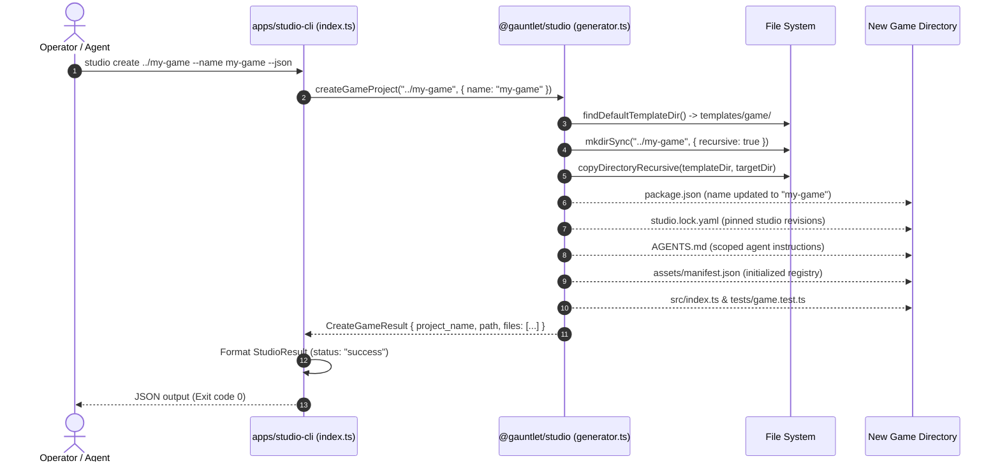

# Execution Trace: Game Project Creation (`studio create`)

This trace documents the end-to-end execution of creating an independent game project using `studio create`. It details template resolution, file copying, lockfile generation, dependency boundary checks, and verification of standalone buildability.

---

## 1. Summary

When a developer or coding agent invokes `studio create <target-path>`, the studio copies the canonical standalone template from `templates/game/` into an isolated target directory. It writes an independent `package.json`, pins studio package versions in `studio.lock.yaml`, configures agent instructions (`AGENTS.md`), initializes `assets/manifest.json`, and verifies that the new project compiles and runs outside the studio monorepo.

---

## 2. Sequence Diagram



---

## 3. Detailed Execution Steps

### Step 1: Invocation & Flag Parsing
The CLI entrypoint in [`apps/studio-cli/src/index.ts`](file:///home/sprime01/projects/gauntlet-game-studio/apps/studio-cli/src/index.ts#L631) matches the `create` command:
```typescript
case "create": {
  const targetPath = positional[1];
  const name = flagValue(args, "--name");
  const templateDir = flagValue(args, "--template");
  const result = createGameProject(targetPath, { name, templateDir });
  // Format StudioResult JSON and exit 0
}
```

### Step 2: Template Directory Resolution
[`generator.ts`](file:///home/sprime01/projects/gauntlet-game-studio/packages/studio/src/generator.ts#L18) searches for candidate template locations:
1. `../../../templates/game` (relative to build output)
2. `../../templates/game` (relative to package src)
3. `templates/game` (relative to current working directory)
If no directory containing `package.json` is found, it throws `Error: Game project template directory not found`.

### Step 3: Recursive Copy & File Scaffolding
[`copyDirectoryRecursive()`](file:///home/sprime01/projects/gauntlet-game-studio/packages/studio/src/generator.ts#L38) copies all template files while preserving relative structure:
- **`package.json`**: Rewrites `name` to the chosen project name. Dependencies reference published or local `@gauntlet/runtime`, `@gauntlet/adapters`, and `@gauntlet/contracts`.
- **`studio.lock.yaml`**: Records the exact studio release and provider revisions to guarantee reproducible asset generation and verification.
- **`AGENTS.md`**: Sets up project-specific agent rules, pointing to local `.agents/specs/game.spec.yaml`.
- **`src/index.ts`**: Provides the game bootstrap entrypoint attaching `createObservabilityBridge()`.
- **`tests/game.test.ts`**: Provides starter headless simulation tests using `GauntletKernel`.

### Step 4: Standalone Buildability Verification
A generated project must not contain private relative imports back into the studio monorepo. Tests in [`packages/studio/src/generator.test.ts`](file:///home/sprime01/projects/gauntlet-game-studio/packages/studio/src/generator.test.ts) verify:
1. The project directory can be copied to a temporary location outside the repository.
2. Running `bun test` inside the isolated directory executes successfully.
3. Zero relative imports (`../../packages/...`) exist in the generated code.

---

## 4. Failure Branches & Error Handling

| Failure Point | Cause | Behavior | Recovery Path |
| :--- | :--- | :--- | :--- |
| Target path missing | Operator ran `studio create` without path | CLI exits with code 1; prints usage error | Provide valid target path |
| Target already populated | Target folder contains unrelated non-empty files | Generator refuses to overwrite conflicting files | Choose empty or new directory |
| Template corrupted | `templates/game/package.json` missing | Generator throws template not found error | Re-clone or restore `templates/game` |

---

## 5. Source Trail

- **CLI Command Dispatch**: [`apps/studio-cli/src/index.ts`](file:///home/sprime01/projects/gauntlet-game-studio/apps/studio-cli/src/index.ts#L631)
- **Generator Implementation**: [`packages/studio/src/generator.ts`](file:///home/sprime01/projects/gauntlet-game-studio/packages/studio/src/generator.ts)
- **Template Scaffold**: [`templates/game/`](file:///home/sprime01/projects/gauntlet-game-studio/templates/game/)
- **Automated Generator Tests**: [`packages/studio/src/generator.test.ts`](file:///home/sprime01/projects/gauntlet-game-studio/packages/studio/src/generator.test.ts)
