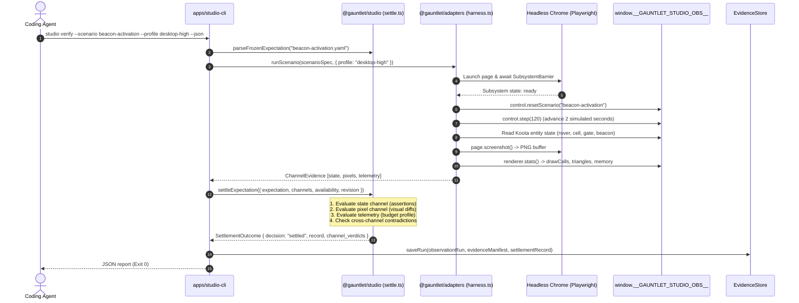

# Execution Trace: Gauntlet Proof & Evidence Settlement

This trace documents the end-to-end execution of the Gauntlet settlement loop (`studio verify`), illustrating how frozen expectations are parsed, how Playwright drives scenarios against the observability bridge, how multi-channel evidence is gathered, and how the settlement engine evaluates contradictions to produce immutable records.

---

## 1. Summary

The Gauntlet settlement engine verifies that a game increment satisfies declared requirements across **state, pixels, and telemetry**. An expectation file (`FrozenExpectation`) specifies the required channels, named scenario, viewport constraints, and pass/fail thresholds. The studio executes the scenario in headless Chrome using Playwright, samples the observability bridge (`window.__GAUNTLET_STUDIO_OBS__`), captures viewport screenshots and renderer statistics, and evaluates the evidence. If all channels pass and no contradictions exist, Gauntlet emits an immutable `SettlementRecord` marking the increment as `settled`.

---

## 2. Sequence Diagram

---

## 3. Detailed Execution Steps

### Step 1: Parsing Frozen Expectations
The CLI parses the scenario expectation file using [`parseFrozenExpectation()`](file:///home/sprime01/projects/gauntlet-game-studio/packages/studio/src/gauntlet/expectation.ts#L160):
- Validates the schema against `FrozenExpectationSchema`.
- Identifies claimed channels: `state`, `pixels`, `telemetry`, `network`.
- Identifies requirement IDs (e.g. `REQ-GOAL-001`, `REQ-PERF-002`).

### Step 2: Playwright Scenario Execution
[`runScenario()`](file:///home/sprime01/projects/gauntlet-game-studio/packages/adapters/src/browser/harness.ts) launches headless Chromium:
- Navigates to the game page (e.g. `http://localhost:3000/dist/index.html`).
- Polls `window.__GAUNTLET_STUDIO_OBS__.readiness()`. It waits until `state === "ready"`. If any required subsystem is `failed`, the run halts immediately.
- Resets the scenario to the initial state using `control.resetScenario(name)`.
- Advances simulation by a fixed tick count using `control.step(ticks)` (bypassing wall-clock waiting).

### Step 3: Tri-Channel Evidence Collection
The harness samples three distinct observation channels:
1. **State Channel**: Calls `surface.entities.snapshot()` to retrieve the Koota entity registry.
2. **Pixel Channel**: Calls Playwright's `page.screenshot()` to capture the rendered canvas.
3. **Telemetry Channel**: Queries `surface.renderer.stats()` and Chrome performance metrics (draw call count, geometry triangle count, texture memory, average frame time).

### Step 4: Settlement Adjudication & Contradiction Detection
In [`settleExpectation()`](file:///home/sprime01/projects/gauntlet-game-studio/packages/studio/src/gauntlet/settle.ts#L192):
- **Channel Check**: Each claimed channel is evaluated independently:
  - State: Does `entities.get("beacon").state.lamp === "active"`?
  - Pixels: Does luminance over the beacon coordinate pass threshold?
  - Telemetry: Does draw call count `<= 45` and triangle count `<= 50000`?
- **Contradiction Evaluation**:
  - If pixels pass but state fails: emits `pixels_pass_state_fail` contradiction.
  - If state passes but pixels fail: emits `state_pass_pixels_fail` contradiction.
  - Any contradiction forces `decision: "failed"`.
- **Confirmation Check**: If the task was classified as high-risk (P3), verifies that independent adversarial confirmation preregistration exists before allowing settlement.

### Step 5: Persistence to EvidenceStore
If settled:
- Writes `ObservationRun` (metadata, timestamp, revision, seed).
- Writes `EvidenceManifest` (file links to screenshots, state dumps, telemetry logs, SHA-256 hashes).
- Writes `SettlementRecord` (the official Gauntlet certification).
- Stored immutably under `artifacts/runs/<run_id>/`.

---

## 4. Failure Branches & Blockage Vocabulary

When settlement does not pass, Gauntlet classifies the blockage into a standardized category (`blockage_class`):

| Blockage Class | Cause | Symptom / Meaning | Recovery Action |
| :--- | :--- | :--- | :--- |
| `evidence_missing` | No manifest or artifacts found | Expected channel evidence was not collected | Re-run scenario with all channels enabled |
| `evidence_stale` | Manifest cites an older git commit | Evidence does not reflect current project revision | Re-run scenario on clean current commit |
| `browser_proof_unavailable` | Environment lacks Chrome / Playwright | Browser cannot launch in environment (e.g. minimal CI container) | Marked as `blocked` (Exit code 2); never marked as passed |
| `insufficiently_represented` | Required Koota entity not found | Entity was never spawned in ECS | Spawn missing entity with required traits |
| `represented_but_deficient` | Entity exists, but trait values wrong | Entity did not transition to expected state | Debug game system logic in `systems.ts` |
| `visual_consequence_deficit` | State passed, but pixels failed | Mesh missing, shader failed, or light off | Fix Three.js visual projection / materials |
| `runtime_consequence_deficit` | Draw calls, triangles, or FPS over budget | Scene exceeds quality profile budget | Optimize geometry or reduce particle count |

---

## 5. Source Trail

- **Settlement Engine**: [`packages/studio/src/gauntlet/settle.ts`](file:///home/sprime01/projects/gauntlet-game-studio/packages/studio/src/gauntlet/settle.ts)
- **Expectation Parser**: [`packages/studio/src/gauntlet/expectation.ts`](file:///home/sprime01/projects/gauntlet-game-studio/packages/studio/src/gauntlet/expectation.ts)
- **Channel Checks**: [`packages/studio/src/gauntlet/checks.ts`](file:///home/sprime01/projects/gauntlet-game-studio/packages/studio/src/gauntlet/checks.ts)
- **Browser Runner**: [`packages/adapters/src/browser/harness.ts`](file:///home/sprime01/projects/gauntlet-game-studio/packages/adapters/src/browser/harness.ts), [`packages/adapters/src/browser/surface-client.ts`](file:///home/sprime01/projects/gauntlet-game-studio/packages/adapters/src/browser/surface-client.ts)
- **Evidence Store**: [`packages/studio/src/evidence/store.ts`](file:///home/sprime01/projects/gauntlet-game-studio/packages/studio/src/evidence/store.ts)
- **Settlement Tests**: [`packages/studio/test/proof/`](file:///home/sprime01/projects/gauntlet-game-studio/packages/studio/test/proof/)
