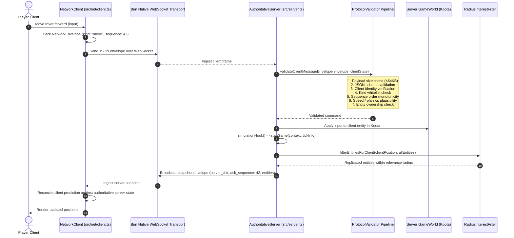

# Execution Trace: Authoritative Multiplayer Loop

This trace documents the complete network execution loop for authoritative multiplayer in the Gauntlet Runtime, covering client command generation, transport envelope transmission, server-side validation, authoritative Koota simulation, spatial interest filtering, and client reconciliation.

---

## 1. Summary

The Gauntlet Runtime provides a server-authoritative multiplayer foundation built on a **Bun native WebSocket baseline**. Clients do not authoritatively mutate gameplay state; they send sequenced, validated command envelopes. The headless server validates envelopes through an 8-stage protocol pipeline, mutates the authoritative Koota ECS world, steps the game simulation once per server tick, filters visible entities using spatial interest management, and broadcasts delta snapshots back to clients for client-side interpolation and reconciliation.

---

## 2. Sequence Diagram



---

## 3. Detailed Execution Steps

### Step 1: Client Command Queueing & Envelopes
When player inputs occur, [`NetworkClient`](file:///home/sprime01/projects/gauntlet-game-studio/packages/runtime/src/network/client.ts#L49) packages them into a strict `NetworkEnvelope`:
```typescript
{
  kind: "command:move",
  sequence: ++this.clientSequence,
  payload: { vx: 4.5, vz: 0.0, steering: 0.2 },
  client_id: "client-player-1",
  timestamp_ms: Date.now()
}
```
Commands are buffered locally in an unacknowledged queue to support client prediction and reconciliation.

### Step 2: Wire Transport
Envelopes transmit over [`BunWebSocketServerTransport`](file:///home/sprime01/projects/gauntlet-game-studio/packages/runtime/src/network/transport-ws.ts), which binds Bun's native high-performance WebSocket implementation (`Bun.serve({ websocket: ... })`).

### Step 3: Server Protocol Validation Pipeline
Before any command mutates server state, [`ProtocolValidator`](file:///home/sprime01/projects/gauntlet-game-studio/packages/runtime/src/network/protocol.ts) executes 8 security and integrity checks:
1. **Size check**: Packet size must not exceed 64 KiB.
2. **Schema validation**: Payload must parse cleanly against `NetworkEnvelopeSchema`.
3. **Identity match**: `envelope.client_id` must match the authenticated socket connection.
4. **Kind whitelist**: Unknown or unauthorized command kinds are dropped.
5. **Sequence verification**: Enforces monotonic sequencing; replay attacks or out-of-order packets are rejected.
6. **Rate limiting**: Enforces maximum message rate per client.
7. **Entity ownership**: Clients can only issue movement commands for entities they own.
8. **Physics plausibility**: Displacement between ticks cannot exceed `maxSpeed * dt`.

### Step 4: Authoritative Simulation Tick
Inside [`AuthoritativeServer.tickOnce()`](file:///home/sprime01/projects/gauntlet-game-studio/packages/runtime/src/network/server.ts):
- Validated inputs are applied to entity traits in the server's `GameWorld`.
- The server invokes the game's simulation hook:
  ```typescript
  simulationHook: (_world, tickInfo) => stepGame(core.context, tickInfo)
  ```
- Physics, AI patrol navigation, and game objective logic advance exactly once.

### Step 5: Spatial Interest Management
Broadcasting all world entities to all connected clients causes bandwidth saturation. [`RadiusInterestFilter`](file:///home/sprime01/projects/gauntlet-game-studio/packages/runtime/src/network/interest.ts) partitions entities:
- Evaluates Euclidean distance between each client entity and world objects.
- Only entities within `relevance_radius` (e.g. 75 meters) are included in that client's snapshot.

### Step 6: Snapshot Replication & Reconciliation
- The server emits a delta snapshot containing the current `server_tick`, `ack_sequence` (the latest acknowledged client command), and serialized entity states.
- The client receives the snapshot:
  - Discards acknowledged commands from its un-acked buffer.
  - Re-applies any remaining un-acked local inputs on top of the server snapshot (client prediction).
  - Smoothly interpolates remote entity positions across ticks.

---

## 4. Network Diagnostics & Impairment Simulation

To prove bounded recovery under hostile network conditions, [`packages/runtime/src/diagnostics/`](file:///home/sprime01/projects/gauntlet-game-studio/packages/runtime/src/diagnostics/) provides:
- **`BandwidthTracker`**: Measures ingress and egress byte rates, packets per second, and message payload sizes.
- **`LatencySimulator`**: Simulates artificial lag, packet jitter, and packet drop percentages in development and testing.
- Reference tests in `examples/blackwater-relay/tests/multiplayer/` prove the game recovers cleanly under 9x simulated latency and 10% packet drop without desynchronization.

---

## 5. Source Trail

- **Authoritative Server**: [`packages/runtime/src/network/server.ts`](file:///home/sprime01/projects/gauntlet-game-studio/packages/runtime/src/network/server.ts)
- **Network Client**: [`packages/runtime/src/network/client.ts`](file:///home/sprime01/projects/gauntlet-game-studio/packages/runtime/src/network/client.ts)
- **Protocol Validation**: [`packages/runtime/src/network/protocol.ts`](file:///home/sprime01/projects/gauntlet-game-studio/packages/runtime/src/network/protocol.ts)
- **Interest Filter**: [`packages/runtime/src/network/interest.ts`](file:///home/sprime01/projects/gauntlet-game-studio/packages/runtime/src/network/interest.ts)
- **WebSocket Transport**: [`packages/runtime/src/network/transport-ws.ts`](file:///home/sprime01/projects/gauntlet-game-studio/packages/runtime/src/network/transport-ws.ts)
- **Diagnostics**: [`packages/runtime/src/diagnostics/bandwidth.ts`](file:///home/sprime01/projects/gauntlet-game-studio/packages/runtime/src/diagnostics/bandwidth.ts), [`packages/runtime/src/diagnostics/latency.ts`](file:///home/sprime01/projects/gauntlet-game-studio/packages/runtime/src/diagnostics/latency.ts)
- **Multiplayer Suite**: [`packages/runtime/test/network/`](file:///home/sprime01/projects/gauntlet-game-studio/packages/runtime/test/network/) (29 tests), [`examples/blackwater-relay/tests/multiplayer/multiplayer.e2e.ts`](file:///home/sprime01/projects/gauntlet-game-studio/examples/blackwater-relay/tests/multiplayer/multiplayer.e2e.ts)
